[TOC]

#       LIMO Usage and Development Manual

中文 | EN

Version: 1.0.0

| Version |        Update information        |     Editor      |
| :-----: | :------------------------------: | :-------------: |
|  1.0.0  | First version opened to customer | Agilex ROS TEAM |
|         |                                  |                 |
|         |                                  |                 |

## 1 LIMO Introduction

### 1.1 Preface

AgileX Robotics LIMO is the world's first ROS development platform that integrates four motion modes. It provides a learning platform that adapts to a wider range of scenarios and is more in line with industry application requirements. It is suitable for robot education, function research and development, and product development. Through innovative mechanical design, it can realize the fast switching of four-wheel differential, Ackermann, track-type, and Mecanum wheel motion modes, and can quickly establish multi-scene practical teaching and testing in the supporting professional sand table. LIMO is equipped with NVIDIA Jeston Nano, EAI XL2 LiDAR, depth camera and other high-performance sensor configurations, which can realize rich functions such as precise autonomous positioning, SLAM mapping, route planning, autonomous obstacle avoidance, autonomous reverse stall parking, traffic light recognition and so on.

At the same time, AgileX Robotics and Gu Yueju, the domestic ROS community teaching pioneer, are committed to combining enterprise employment and industry application needs to create a new ROS boutique course based on the LIMO-developed car to help colleges and universities in scientific research and teaching, so that students can meet higher technical requirements for industry applications.

### 1.2 Component list

|        Name        |           Quantity           |
| :----------------: | :--------------------------: |
| LIMO high-end body |              x1              |
|      Battery       |              x1              |
|      Charger       |              x1              |
|   Mecanum wheel    |              x4              |
|     APP_Nexus      |              X1              |
|       Track        |              x2              |
| Cross screwdriver  |              1               |
|       Screw        | M3x12mm，3pcs；M3x5mm，20pcs |

        


  


### 1.3 Tech specifications

<table>
	<tr>
		<td>Items</td>
		<td>Parameters</td>
        <td>Values</td>
	</tr>
	<tr>
		<td rowspan="8">Mechanical</td>
		<td>Overall dimension</td>
        <td>322*220*251mm</td>
	</tr>
	<tr>
		<td>Wheel base</td>
        <td>200mm</td>
	</tr>
    	<tr>
		<td>Tread</td>
        <td>175mm</td>
	</tr>
    	<tr>
		<td>Dead load</td>
        <td>4.8kg</td>
	</tr>
    	<tr>
		<td rowspan="3">Load</td>
            <td>1kg（Four-wheel differential）</td>
            <tr>
				<td>4kg（Ackermann mode）</td>
			</tr>
            	<tr>
                <td>4kg（Wheat wheel）</td>
    		</tr>
	</tr>
    	<tr>
		<td>Minimum ground clearance</td>
            <td>24mm</td>
	</tr>
    	<tr>
		<td>Drive type</td>
            <td>Hub motor (4x14.4W)</td>
	</tr>
<tr>
		<td rowspan="4">Performance </td>
		<td>No-load max. speed</td>
        <td>1m/s</td>
	</tr>
<tr>
		<td>Ackermann minimum turning radius</td>
        <td>0.4m</td>
	</tr>
<tr>
		<td>Work environment</td>
        <td>-10~+40℃</td>
	</tr>
<tr>
		<td>Max. climbing capacity</td>
        <td>40°（under track mode）</td>
	</tr>
	<td rowspan="10">System</td>
		<td>Power interface</td>
        <td>DC（5.5x2.1mm)</td>
	</tr>
	<tr>
		<td>OS</td>
        <td>Ubuntu18.0</td>
	</tr>
    	<tr>
		<td>IMU</td>
        <td>MPU6050</td>
	</tr>
    	<tr>
		<td>CPU</td>
        <td>ARM 64-bit 4-core@1.43GHz （Cortex-A57）</td>
	</tr>
    	<tr>
	</tr>
    	<tr>
		<td>GPU</td>
        <td>128-core NVIDIA Maxwell @921MHz</td>
	</tr>
    	<tr>
		<td>Battery</td>
            <td>5200mAh 12V</td>
	</tr>
    	<tr>
		<td>Working time</td>
            <td>40min</td>
	</tr>
    	<tr>
		<td>Stand-by time</td>
            <td>2h</td>
	</tr>
    	<tr>
		<td>Communication interface</td>
            <td>WIFI,Bluetooth</td>
	</tr>
	<td rowspan="8">Sensor</td>
		<td>LIDAR</td>
        <td>EAI X2L</td>
	</tr>
	<tr>
		<td>Depth camera</td>
        <td>DaBai/RealSense D435</td>
	</tr>
    	<tr>
		<td>IPC</td>
        <td>NVIDIA Jetson Nano（4G）</td>
	</tr>
    	<tr>
		<td>Voice module</td>
        <td>iFlytek Voice Assistant/Google Assistant</td>
	</tr>
    	<tr>
		<td>Speaker</td>
        <td>Left and right dual channels（2x2W)</td>
	</tr>
    	<tr>
		<td>USB-HUB </td>
            <td>TYPE-C x1，USB2.0 x2</td>
	</tr>
    	<tr>
		<td>Front display</td>
            <td>1.54 inch 128x64 white OLED display screen</td>
	</tr>
    	<tr>
		<td>Rear display</td>
            <td>7 inch 1024x600 IPS touch screen</td>
	</tr>
	<td rowspan="2">Control</td>
		<td>Control mode</td>
        <td>Mobile APP，command control</td>
	</tr>
	<tr>
		<td>Mobile APP</td>
        <td>Bluetooth，maximum distance 10m</td>
	</tr>
</table>


### 1.4 Nvidia Jetson Nano introduction

Nvidia Jetson Nano is a powerful small computer designed to support entry-level edge AI applications and devices. Relying on the comprehensive NVIDIA JetPack™ SDK, it contains acceleration libraries for deep learning, computer vision, graphics, multimedia, etc. Equipped in the limo high-end version, it can be used for the expansion of robot navigation and positioning, image processing, voice recognition etc.

| GPU                | 128-Core Maxwell                                             |
| ------------------ | ------------------------------------------------------------ |
| CPU                | Quad-core ARM57 @1.43Ghz                                     |
| Memory             | 4GB 64Bit LPDDR4 25.6GB/s                                    |
| Storage            | Micro SD卡（default）                                        |
| Video encode       | 4K@30\| 4 X 1080p@30 \| 9 X 720p@30(H.264/H.265)             |
| Video decode       | 4K@60\| 2X 4K@30 \| 8X 1080p@30 \| 18 X 720p@30(H.264/H.265) |
| Camera             | 2 X MIPI CSI-2 DPHY lanes                                    |
| Networking         | Gigabit Ethernet, external expansion of M.2 Key E interface  |
| Display            | HDMI X 1, DP X 1                                             |
| USB                | 4 X USB 3.0, USB 2.0 Micro-B                                 |
| Extended interface | GPIO，I2C，I2S，SPI，UART                                    |

### 1.5 Component name


①　WIFI/Bluetooth antenna；

②　Depth camera；

③　Front display；

④　EAI X2L LiDAR;

⑤　Hub motor；

⑥　RGB light；

⑦　Four-wheel differential/Ackermann mode switching latch；

⑧　Power display；

⑨　Left speaker；

⑩　Left seagull door；


⑪　Rear display；

⑫　Battery door；

⑬　Switch；

⑭　Right seagull door；

⑮　Right speaker；

 

⑯　USB-HUB；

 

⑰　Voice module；

⑱　IPC NVIDIA Jetson Nano（4G）；

⑲　Battery；

### 1.6 Function highlights

（1）Four hub motors are used to save the internal space of the vehicle body, and the four modes of Ackermann, four-wheel differential, track and Mecanum wheel can be quickly switched on one vehicle body;


①Ackermann mode：

A geometry designed to solve the problem of wheels on the inside and outside of a turn needing to trace out circles of different radii in the steering of vehicles. A vehicle designed according to Ackermann steering geometry, when turning along a curve, use the four-link equal crank to make the steering angle of the inside wheel about 2 to 4 degrees larger than that of the outside wheel, so that the centers of the four wheel paths roughly meet on the extension line of the rear axle; and then the wheels instantly turn to the center, allowing the vehicle to turn smoothly.

 

②Four-wheel differential mode：

Four-wheel drive, which can realize in-situ auto-rotation, but it will cause serious tire wear; please do not auto-rotate in-situ for a long time；

 

③Track mode：

It has good off-road performance and can climb 40° slopes and small steps；

 

④Mecanum wheel mode：

The omni-directional motion equipment based on Mecanum wheel technology can realize forward, lateral, oblique, rotation and combinations of motion modes.


（2）Indication of vehicle light status：

The two vehicle lights are RGB LEDs, and 5 high-contrast colors are used for indicator lights, and the rest of the colors can be customized by the developer;

| Color        | Status                             |
| ------------ | ---------------------------------- |
| Red flashing | Low battery/master control alarm   |
| Green        | Ackermann mode                     |
| Yellow       | Four-wheel differential/track mode |
| Blue         | Mecanum wheel mode                 |
| Red          | Software shut down                 |

 

（3）Doors on both sides can be expanded to reserve a Type-C interface and two USB2.0 interfaces for convenient debugging;


（4）The battery can be removed and replaced;

 

（5）Reserve rich expansion holes:

Eight M3 screw holes and two 3.2mm wide notches are reserved on the roof;


Four M3 screw holes are reserved for the two doors to expand horizontally to obtain a larger mounting platform;


Four M3 screw holes are reserved at the front and rear of the underbody.

 

（6）Rich interactive experience:

Camera, LiDAR, voice module, dual speakers and front display can provide rich interactive experience.


### 1.7 Mode switching method

（1）Switch to Ackermann mode:

First pull up the latches on both sides, and turn 30 degrees clockwise to make the longer line on the two latches points to the front of the vehicle body , and then they will be stuck. When the vehicle light turns green and is steady on, the switch is successful;


（2）Switch to four-wheel differential mode:

  Pull up the two latches, and turn 30 degrees clockwise to make the shorter line on the two latches points to the front of the vehicle body. At this point, it is in insertion state. Fine-tune the tire angle to align the hole so that the latch is inserted. When the vehicle light turns yellow and is steady on, the switch is successful;

 


（3）Switch to track mode:

In the four-wheel differential mode, put the track on directly; it is recommended to put the track on the rear wheel with small space first, and in the track mode, please lift the doors on both sides to prevent scratches;

 

（4）Switch to Mecanum wheel mode:

First remove the hubcaps and tires, leaving only the hub motor, then ensure that the small roller of each Mecanum wheel is facing the center of the body, install the Mecanum wheel with the M3*5 screw in the package, and finally adjust to the Mecanum wheel mode with remote control /APP.

 


 

**Note:** When switching to Mecanum wheel mode, make sure that each Mecanum wheel is installed at the angle shown above

### 1.8 Instructions on operation

（1）Long press the switch to start (short press it to pause the program), observe the electricity meter, and charge or replace the battery in time when the last red light is on;


（2）Observe the status of the front latch and the color of the vehicle light to judge the current mode:


| **Color**    | **Status**                         |
| ------------ | ---------------------------------- |
| Red flashing | Low battery/master control alarm   |
| Red          | Software shut down                 |
| Green        | Ackermann mode                     |
| Yellow       | Four-wheel differential/track mode |
| Blue         | Mecanum wheel mode                 |

（3）Instructions on APP remote control

1. First download the APP--Nexus provided by our company on the mobile phone. The download method is as follows: 

​       IOS download: search for Nexus in AppStore and download it.

For Android, scan the following QR code:

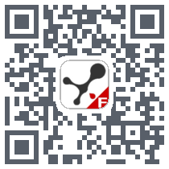 

Download link：https://www.pgyer.com/lbDi

2. After downloading the App successfully, open the App; as shown in Figure 1-1, connect to the Bluetooth of LIMO_xxxxxx; click the Bluetooth icon on the upper left of the Android phone to enter the Bluetooth scanning interface

 

3. Remote control limo

Left lever: control limo forward and backward.

Right lever: Control limo to turn left and right.

Middle progress bar: speed value display.

Mode switching: There are three modes in total, Ackermann motion mode: ackermann; four-wheel differential motion mode: 4wd; Mecanum motion mode: mailun

Ackermann: You need to manually switch LIMO to Ackermann mode, which is mainly used to calibrate the zero point, and control forward and backward as well as rotation angle; 

4wd: You need to manually switch LIMO to the four-wheel differential mode, which mainly controls forward and backward, rotation direction and rotation in place;

Mailun: You need to manually switch LIMO to the Mecanum wheel mode, which mainly controls forward and backward, rotation direction, and rotation in place.

4. Instructions on APP setting

Language switch：Switch between English and Chinese by clicking the button English/Simplified on the right.

Left-romte min speed：Set the minimum speed of LIMO.

Left-romte max speed：Set the maximum speed of LIMO.

right-romte min speed：Set the minimum rotation speed of LIMO.

right-romte max speed：Set the maximum rotation speed of LIMO.

veer calibration：To set the zero point calibration, first click the + sign, and then click Confirm Verify. When the calibration is successful, a reminder box will pop up: Successful calibration.

BlueTooth：Click to pop up the Bluetooth scanning interface.

Bluetooth management:  Click random to generate any name named after LIMO_xxxx, confirm OK and modify the Bluetooth name of the vehicle synchronously. Note that the Bluetooth will be disconnected at this time and will remind you to reconnect the Bluetooth. After reconnecting the Bluetooth, you can continue to control the vehicle; when the app is started again, the Bluetooth name of the vehicle has been modified successfully.


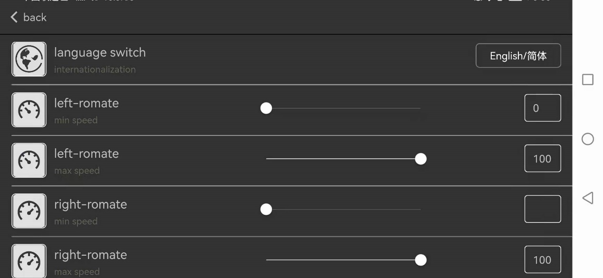


### 1.9 Remote desktop connection

#### 1.9.1 Download and install NoMachine

First download the corresponding software on your personal computer; download link: https://www.nomachine.com/download; download the corresponding version according to your computer's operating system and architecture. Let limo and computer connect to the same WIFI.                         

#### 1.9.2 Connect to wifi

Open the seagull door on the right side of limo, find the USB-HUB module, and connect the keyboard and mouse to limo. The position of the USB-HUB module is as shown in the figure below:


After the keyboard and mouse are successfully connected, connect to wifi through the following operations, and select the wifi that needs to be connected.


Enter the password of wifi:


#### 1.9.2 Connect limo remotely

Select connection object


Click Yes


Username：agilex ,  Password：agx,    select to save the password


Always select the default : OK.


## 2 Instructions on Chassis Electrical Information

###  2.1 Battery and charging

#### 2.1.1 Basic battery information

LIMO is equipped with a 12V battery with two interfaces. They are the yellow battery output interface and the black battery charging interface.

The parameters of battery are as follow：

|              **Items**               | **Rated parameters** |
| :----------------------------------: | :------------------: |
|           Typical capacity           |       5200mAH        |
|           Minimum capacity           |       5000mAH        |
|           Nominal voltage            |        11.1V         |
|        Charge cut-off voltage        |        12.6V         |
|      Discharge cut-off voltage       |        8.25V         |
| Maximum continuous discharge current |         10A          |

##### Battery precautions

------

- In order to ensure the safety of transportation and storage, the battery supplied with LIMO is not necessarily fully charged.

- Please do not charge the battery after its power has been depleted, 

  and please charge the battery in time when LIMO’s low battery level alarm 

  is on;

- LIMO will still generate a quiescent standby current when it is turned off. To prevent the battery from over-discharging, please disconnect the battery from the vehicle body when you do not use LIMO for a long time.

- Please do not put the battery in fire or heat up the battery, and please do not store the battery in high-temperature environment. The best temperature for battery storage is -10℃~40℃.

- LIMO must be charged with the original factory-equipped or certified battery.

------

####  2.1.2 Charging

LIMO is equipped with a 12.6V 2A charger by default to meet customers’ charging demand, and there is an indicator light on the charger to show the charging status.

------

- When charging, please turn off the vehicle and remove the battery, and separate the battery output interface from the vehicle body.
- Connect the charging connector of the charger to the battery, and then turn on the charger's power supply for charging.
- When fully charged, please separate the battery from the charger first, and then disconnect the charger.

------

The charger status is as follows:

| **Charger indicator light’s color** |  **Charger status**  |
| :---------------------------------: | :------------------: |
|                 Red                 |       Charging       |
|           Green flashing            | Almost fully charged |
|                Green                |    Fully charged     |

##### Charging precautions:

------

- It is forbidden to use non-original chargers to charge the battery, and do not charge the battery below 0°C.

- The battery must be separated from LIMO’s vehicle body when charging, and it is forbidden to supply power to LIMO while charging the battery.
- When the indicator light of the charger turns green, it indicates that the charging is complete, but in order to prolong the battery life, the charger will trickle charge with a current of 0.1A for about 0.5 hours.

- At present, it takes about 2.5 hours for the battery to reach a fully charged state from 8.25V, and the fully charged voltage of the battery is about 12.6V.

### 2.2 Operational environment and safety precautions

------

- The operating temperature of LIMO is -10°C ~ 40°C; please do not use it in an environment with a temperature lower than -10°C or higher than 40°C;
- The relative humidity requirements of LIMO's operational environment are: maximum 80%, minimum 30%;
- Please do not use it in an environment with corrosive and flammable gas or in an environment near flammable substances;
- LIMO is not waterproof, so please do not use it in an environment with rain, snow, or water;
- It is recommended that the altitude of the operational environment should not exceed 1000M, and the temperature difference between day and night should not exceed 25°C;
- In case of any doubts during use, please operate according to the relevant instruction manual or consult related technical personnel;  
- Without technical support and permission, please do not personally modify the internal equipment structure.

### 2.3 Power supply topology

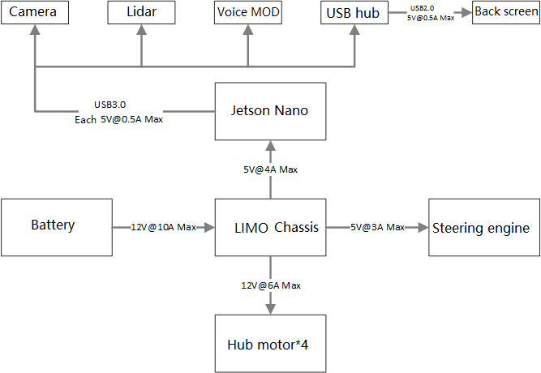

------

- LIMO's battery can provide a maximum current of 10A to power the chassis, Nano, and sensors. When the system detects that the operating current is greater than 10A, it will enter an overcurrent protection mode to protect the battery and motor.

- The total output current of the three USB interfaces of USB HUB is 0.5A at most.

### 2.4 Communication topology

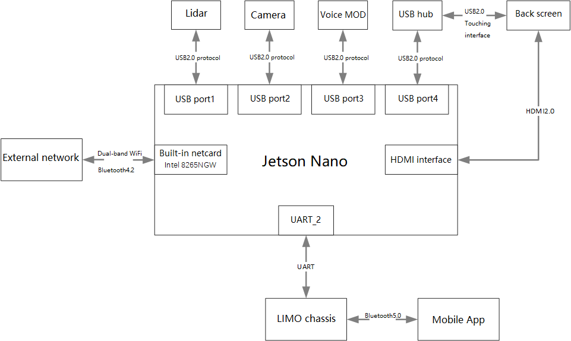

------

- The LIMO chassis has a built-in Bluetooth 5.0 module that can be connected to the APP on the mobile phone to realize the remote control function.
- LIMO and Nano are directly connected through a UART interface, and Nano can control the chassis through this interface.
- USB HUB provides 2 USB interfaces and 1 Type C interface; all 3 interfaces work under the USB2.0 protocol.
- The rear display screen is connected to the USB HUB through the USB2.0 interface and has a touch function.


## 3 Chassis Driver Drive

The mobile chassis needs to be driven by a program to realize the navigation of limo. The chassis driver of limo is divided into two versions, namely the C++ version and the Python version. Both versions can control the movement of limo.

### 3.1 C++ chassis driver

The folder where the C++ version of the driver is located is ~/agilex_ws/src/limo_ros/limo_base, which can be accessed by the following command.

```
cd agilex_ws/src/limo_ros/limo_base
```

The following is the file list of the limo_base package:

```
├── limo_base
    ├── CMakeLists.txt
    ├── include
    │   ├── limo_driver.h
    │   ├── limo_protocol.h
    │   └── serial_port.h
    ├── launch
    │   └── limo_base.launch
    ├── msg
    │   └── LimoStatus.msg
    ├── package.xml
    └── src
        ├── limo_base_node.cpp
        ├── limo_driver.cpp
        └── serial_port.cpp
```

There are four folders under limo_base, namely include, launch, msg, and src. The include folder stores the library files called by the driver; the launch folder stores the startup files of the driver; the msg folder stores the message files needed by the driver; the src folder stores the driver source code.

| **Folder** | **Stored files**                   |
| ---------- | ---------------------------------- |
| include    | Library files called by the driver |
| launch     | Startup files of the driver        |
| msg        | Message files needed by the driver |
| src        | Driver source code                 |

You can control the forward movement of limo with a simple command.

Note: Before running the command, please make sure that the programs in other terminals have been terminated. The termination command is: Ctrl+c.

1. Launch the chassis, open a terminal, and enter the command in the terminal:

```
roslaunch limo_base limo_base.launch
```

2. Enter the control command, open a terminal, and enter the command in the terminal:

```
rostopic pub /cmd_vel geometry_msgs/Twist "linear:
  x: 0.2
  y: 0.0
  z: 0.0
angular:
  x: 0.0
  y: 0.0
  z: 0.0" 
```

**Note:** Copy the entire command to the terminal and enter it, and don’t enter it manually.

After entering the command in the terminal, limo will walk a short distance before stopping.

Functions used in the driver source code:

| **Name**                     | Function                                                     |
| ---------------------------- | ------------------------------------------------------------ |
| connect()                    | Connect the chassis                                          |
| readData()                   | Read the data, and get the information feedback from the chassis |
| processRxData()              | Receive serial data                                          |
| parseFrame()                 | Process serial data                                          |
| sendFrame()                  | Send serial data                                             |
| setMotionCommand()           | Set limo’s control mode                                      |
| enableCommandedMode()        | Enable control mode                                          |
| publishOdometry()            | Publish odometer data                                        |
| publishLimoState()           | Publish limo’s state information                             |
| publishIMUData()             | Publish IMU data                                             |
| processErrorCode()           | Error detection                                              |
| twistCmdCallback()           | Publish speed control data                                   |
| normalizeAngle()             | Output a normal angle                                        |
| degToRad()                   | Turn the angle to radian                                     |
| convertInnerAngleToCentral() | Convert inner angle to central angle                         |
| convertCentralAngleToInner() | Convert central angle to inner angle                         |

### 3.2 Python chassis driver

limo's driver (Python version) is uploaded to pypi, and the driver can be downloaded through the pip command; the installation directory of the program is ~/.local/lib/python3.6/site-packages/pylimo. Its file list is:

```
├── __init__.py
├── limomsg.py	
├── limo.py	
└── __pycache__
    ├── __init__.cpython-36.pyc
    ├── limo.cpython-36.pyc
    └── limomsg.cpython-36.pyc
```

The Python version of the code is relatively concise, and only three files make up the driver. The function of init.py is to declare the files to be used, the function of limomsg.py is to drive to the required messages, and limo.py is the main program and its function is driving limo.

| **File name** |             Function             |
| :-----------: | :------------------------------: |
|    init.py    |   Declare the files to be used   |
|  limomsg.py   |  Drive to the required messages  |
|    limo.py    | Main program, used to drive limo |

We provide a script to call the driver. The directory where the script is located is agilex_ws/src/limo_ros/limo_base/script, and the script’s name is limomove.py.

You can access this directory with the following command, open the terminal, and enter the command in the terminal:

**Note:** Before running the command, please make sure that the programs in other terminals have been terminated. The termination command is: Ctrl+c.

```
cd agilex_ws/src/limo_ros/limo_base/script
```

Run the script, open the terminal, and enter the command in the terminal:

```
python3 limomove.py
```

After entering the command in the terminal, limo will walk a certain distance before stopping.

Functions used in the driver:

| Name                 | Function                 |
| -------------------- | ------------------------ |
| EnableCommand()      | Control enable           |
| SetMotionCommand()   | Set motion command       |
| GetLinearVelocity()  | Get linear velocity      |
| GetAngularVelocity() | Get angular velocity     |
| GetSteeringAngle()   | Get steering angle       |
| GetLateralVelocity() | Get lateral velocity     |
| GetControlMode()     | Get control mode         |
| GetBatteryVoltage()  | Get battery level        |
| GetErrorCode()       | Get error code           |
| GetRightWheelOdem()  | Get left wheel odometer  |
| GetLeftWheelOdem()   | Get right wheel odometer |
| GetIMUAccelData()    | Get IMU acceleration     |
| GetIMUGyroData()     | Get gyroscope data       |
| GetIMUYawData()      | Get IMU course angle     |
| GetIMUPichData()     | Get pitch angle          |
| GetIMURollData()     | Get roll angle           |


## 4 Chassis Kinematics Analysis

Mobile robots are so popular nowadays, including large robots like unmanned vehicles, regulars robots like AGVs (eg. intelligent logistics automatic handling robots) which are widely used in industry, and small robots like the smart vehicles on Taobao. Mobile robots have a variety of chassis, including two-wheel, three-wheel, and four-wheel ones. For example, unmanned vehicles are four-wheel Ackermann models, and general AGVs are two-wheel differential models. There are also three-wheel omni-wheel chassis and four-wheel omni-wheel chassis that are common in college student robot competitions. There are also some AGVs with four-wheel skid chassis. Is it a bit dazzling? This section will introduce the four motion modes of limo from the kinematics aspect.

### 4.1 Four-wheel differential motion mode

We simplify a four-wheel differential motion robot into the model shown in the figure below. Four wheels are driven by four separate motors. You can control the robot to move forward, backward, and steer only by controlling the velocity of the four wheels.


We give the robot a reference coordinate system. The red arrow is the positive direction of the X axis, the blue arrow is the positive direction of the Y axis, the Z axis is perpendicular to the screen outward along the origin, the coordinate origin is the center of mass of the robot, and the coordinate system satisfies the Ampere’s right-hand rule. When the velocity (size + direction) of the four wheels is the same, the robot can move forward and backward. When the velocities of the four wheels are not the same, the robot will turn.

Once the robot turns, it means that there is a turning center, which is the point ICR in the figure below. Taking the left front wheel as an example, the relative velocity direction of the contact point A of the wheel and the ground is shown in the figure. The resultant velocity direction and the line segment A-ICR are perpendicular to each other, and the tire can only rotate along the longitudinal component velocity direction. The velocity resolution shows that there is also a lateral component velocity along the wheel axis (motor axis).


Since the lateral component velocities of the four tires are different, the robot will produce rotational sub-motions, while the longitudinal component velocities produce longitudinal sub-motions. The resultant motion is represented by the robot making a circular motion around the ICR. 

When the robot turns, the angular velocity of the tires on both sides is the same. The inner tire has a smaller turning radius, so the linear velocity is smaller, and the outer tire has a larger turning radius, so the outer linear velocity is greater. That is, when the velocity on the right side is greater, it will turn left. Similarly, when the velocity on the left side is greater, it will turn right.

Moreover, it can be seen from the figure above that the tires on the same side have the same Vx (longitudinal component velocity), and the tires at the upper (lower) end have the same Vy (lateral component velocity). If you want the vehicle to rotate around itself, you only need the two wheels on the left (right) side to have the same velocity and the same direction, while the two wheels on the right (left) side have the same velocity as the other side, but the direction is opposite to the other side.

We can try to control limo in four-wheel differential mode. First, adjust limo to four-wheel differential mode, pull up the two latches, and turn 30 degrees clockwise to make the shorter line on the two latches points to the front of the vehicle body. At this point, it is in insertion state. Fine-tune the tire angle to align the hole so that the latch is inserted. When the vehicle light turns yellow, the switch is successful.

After the mode switch is successful, run the following command, and we can launch the keyboard or handle to control.

Launch chassis control node

**Note:** Before running the command, please make sure that the programs in other terminals have been terminated. The termination command is: Ctrl+c.

```
roslaunch limo_base limo_base.launch
```

Launch keyboard control node

```
roslaunch limo_bringup limo_teletop_keyboard.launch  
```

### 4.2 Track motion mode

In the track differential mode, a single-sided track can be equivalently regarded as an "infinite number of small wheels", and the "speed" of the single-sided "infinite number of small wheels" is the same. Therefore, the steering mode of the track differential mode is the same as that of the four-wheel differential mode, which is also slide steering.

Specifically, the track differential motion and the four-wheel differential motion are achieved by controlling the relative velocity of the tracks (or wheels) on both sides, but there are also differences between them: the shear and pressure distribution generated by the track on the ground are different from those of the wheels. This difference has little effect when it comes to wheel speed control. When the wheel speeds are inconsistent, we can refer to the following simplified model.


ICR is the center of motion rotation, CENTER is the geometric center of the robot, and COM is the center of mass of the robot. When turning, the velocity of the inner track is lower than that of the outer track. If you want the vehicle to rotate around itself, you only need the left (right) side track to have the same velocity and the same direction, while the track velocity on the right (left) side is the same as the other side, but the direction is opposite to the other side.

In the four-wheel differential mode, put the track on directly; it is recommended to put the track on the rear wheel with small space first, and in the track mode, please lift the doors on both sides to prevent scratches.

After the replacement is completed, run the following command, and we can launch the keyboard or handle to control.

Launch chassis control node:

Note: Before running the command, please make sure that the programs in other terminals have been terminated. The termination command is: Ctrl+c.

```
roslaunch limo_base limo_base.launch
```

Launch keyboard control node:

```
roslaunch limo_bringup limo_teletop_keyboard.launch  
```

### 4.3 Ackermann motion mode

Ackermann steering structure is the steering method of modern cars, which can solve the problem of different steering angles of the left and right steering wheels caused by the different steering radii of the left and right steering wheels when the car is steering.

First, look at the simplified model of Ackermann motion mode. Same as the differential motion, if we give the four wheels the same velocity (size + direction), the robot can move forward and backward. The difference lies in turning. It is necessary to use the Ackermann steering geometry to calculate the turning radius based on the deflection direction of the two front wheels. The point CENTER is the geometric center of the robot, and the point BASE is the midpoint of the rear rod. At this time, the robot will make a circular motion around the ICR, and this turning radius is also the minimum turning radius. It can be seen from the figure that the deflection angles of the two wheels in the front section are not the same, and the difference between the deflection angles of the two wheels (θA-θB) is the Ackermann angle. If the robot still uses four-wheel drive in the Ackermann motion mode, the velocity of the inner wheel is lower than that of the outer wheel when turning.


Ackermann can be further simplified as the model of the bicycles we usually ride. The orange part in the figure above is the robot’s equivalent bicycle model. Compared with the differential motion mode, the Ackermann motion mode has a turning radius limitation, and the mobile robot cannot achieve spin, that is, the turning radius cannot be zero.

First pull up the latches on both sides, and turn 30 degrees clockwise to make the longer line on the two latches points to the front of the vehicle body, and then they will be stuck. When the light turns green, the switch is successful, and the limo is switched to Ackermann motion mode.

After the mode switch is successful, run the following command, and we can launch the keyboard or handle to control.

After the switch is successful, run the following command, and we can launch the keyboard or handle to control.

Launch chassis control node:

**Note:** Before running the command, please make sure that the programs in other terminals have been terminated. The termination command is: Ctrl+c.

```
roslaunch limo_base limo_base.launch
```

Launch keyboard control node:

```
roslaunch limo_bringup limo_teletop_keyboard.launch  
```

**Note:** When the vehicle cannot go straight in Ackermann mode, the steering gear calibration is required.

### 4.4 Mecanum motion mode

The Mecanum wheel is a special kind of wheel, which is composed of a hub and rollers: the hub is the main support of the entire wheel, and the rollers are passively moving drums (small wheels) mounted on the hub. The two form a complete big wheel. The angle between the hub axis and the roller shaft on the market can be roughly divided into 30 degrees, 45 degrees, and 60 degrees. In order to meet the geometric relationship of omnidirectional motion, the edge of the hub adopts a bending process to provide mounting holes for the shaft of the roller.

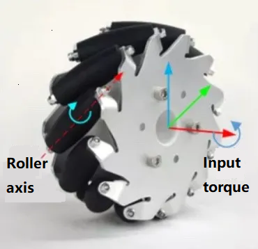

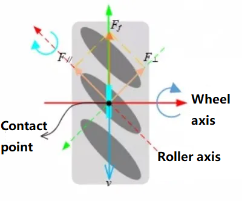

Assuming that the wheel rotates counterclockwise, the force analysis of the Mecanum wheel is carried out. In the coordinate system in the above figure, red represents the x axis, green represents the y axis, blue represents the z axis, the roller coordinate system is represented by a dotted line, and the hub coordinate system is represented by a solid line; the yellow arrow indicates the force analysis of the Mecanum wheel and roller; the blue arrow indicates the speed direction.

The rollers on the periphery of the Mecanum wheel are in contact with the ground. When the Mecanum wheel rotates around the hub axle, the rollers will generate frictional force Ff with the ground, and the force direction is the positive direction of the Y axis of the hub coordinate system. The orthogonal decomposition of Ff along the roller coordinate system shows that F1 is along the negative direction of the Y axis of the roller, and the size is √2/2Ff, and FII is along the positive direction of the X axis of the roller, and the size is √2/2Ff. F1 is the rolling friction of the roller, which causes wear to the roller and cannot change the direction of movement of the tire. FⅡ will force the roller to move in the positive direction of the X axis, so FⅡ is static friction, which promotes the roller to move relative to the ground.


Different wheel arrangements also require different control methods. The omnidirectional movement of the Mecanum wheel is simplified to the model shown in the figure above. The blue arrow indicates the direction of wheel movement, and the orange arrow represents the force analysis of the Mecanum wheel. Combining the forces, we will find that the mobile robot has only one forward force, so the robot will move forward at this time.

Combine the friction of each tire based on the previous four-wheel differential motion mode, the robot can move in any direction. Below are some examples of tire conditions when moving in different directions.

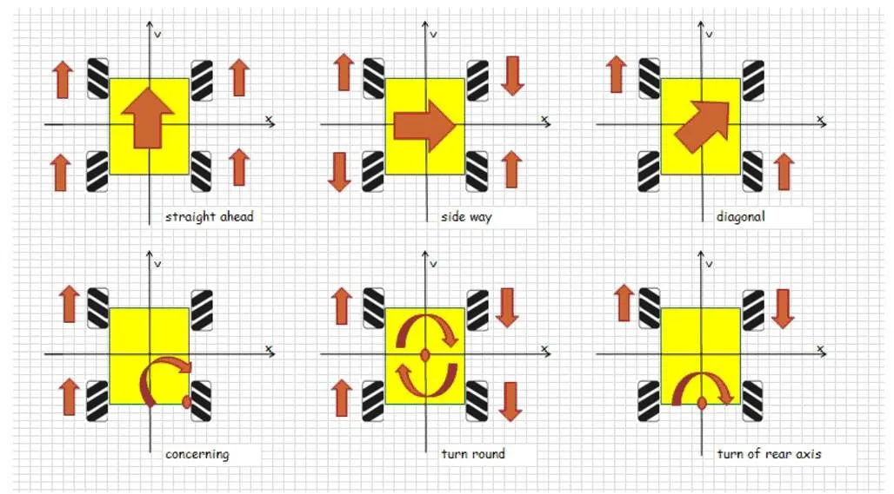

First remove the hub cover and tires, leaving only the hub motor, and then make sure that the small rollers of each Mecanum wheel are facing the center of the vehicle body. Use the M3*5 screws in the package to install the Mecanum wheel. The remote control/APP needs to be adjusted to the Mecanum wheel mode during remote operation.

When the remote control handle is in the four-wheel differential control mode, when channel 8 is in the lowest gear, it switches to the Mecanum wheel control mode, and when it is in the middle and upper gear, it switches back to the differential mode;

Launch chassis control node:

**Note:** Before running the command, please make sure that the programs in other terminals have been terminated. The termination command is: Ctrl+c.

```
roslaunch limo_base limo_base.launch
```

Launch keyboard control node:

```
roslaunch limo_bringup limo_teletop_keyboard.launch  
```

There are many motion modes of mobile robots, and each has its advantages and disadvantages. In actual scenes, we can choose the most suitable motion mode according to the characteristics and needs of the scene. The following table summarizes the advantages and disadvantages of the four motion modes, for reference only.

| Mode          | **Four-wheel differential**                   | **Track**                                                    | **Ackermann**                                                | **Mecanum**                                                  |
| ------------- | --------------------------------------------- | ------------------------------------------------------------ | ------------------------------------------------------------ | ------------------------------------------------------------ |
| Advantages    | Good motion performance and simple control    | Strong adaptability, good off-road performance, and suitable for a variety of complex sites | Same as the motion mode of a car, which facilitates in-depth research on autonomous driving | Good mobility, and omnidirectional motion                    |
| Disadvantages | Slippage during steering, and large tire wear | Large sliding steering resistance, and large wear on the track | Limited turning radius, and low tire wear                    | High site requirements, non-continuous rollers, vibration during movement, and large wear |


## 5 LiDAR Mapping

### 5.1 Introduction and use of LiDAR

 YDLIDAR X2L LiDAR is a 360-degree two-dimensional ranging product developed by Shenzhen EAI Technology Co., Ltd. (EAI). This product is based on the principle of trigonometric ranging and is equipped with related optical, electrical, and algorithm design to achieve high-frequency and high-precision distance measurement. While measuring distance, the mechanical structure rotates 360 degrees and continuously obtains angle information, thereby achieving 360 degrees scanning distance measurement, and output point cloud data of the scanning environment.

| **Items**          | Minimum    | Default    | Maximum    | Unit | Remarks                                                      |
| ------------------ | ---------- | ---------- | ---------- | ---- | ------------------------------------------------------------ |
| Ranging frequency  | /          | 3000       | /          | Hz   | 3000 ranging times per second                                |
| Scanning frequency | 5          | 6          | 8          | Hz   | PWM signal needs to be connected, and the recommended frequency is 6Hz. |
| Ranging range      | 0.12       | /          | 8          | m    | Indoor environment, and objects with 80% reflectivity        |
| Scanning angle     | /          | 0-360      | /          | °    | /                                                            |
| Absolute tolerance | /          | 2          | /          | cm   | When ranging ≤1m                                             |
| Relative tolerance | /          | 3.5%       | /          | /    | When 1m < ranging ≤ 6m                                       |
| Pitch angle        | 0.25       | 1          | 1.75       | °    | /                                                            |
| Angle resolution   | 0.60 (5Hz) | 0.72 (6Hz) | 0.96 (8Hz) | °    | Different scanning frequency                                 |

Its usage is as follows:

Launch a new terminal and enter the command in the terminal:

```
roslaunch limo_bringup limo_start.launch pub_odom_tf:=false
```

After launching successfully, the terminal will output the following log information, as shown in the figure:


Then launch a new terminal and enter the command in the terminal:

```
roslaunch limo_bringup limo_lidar_rviz.launch
```

After successfully running, you will see the rviz visualization tool open, and the green data displayed is the laser data scanned by the LiDAR.


At this time, you can set the remote control to remote control mode  to remote control the vehicle to move. At this time, you will see that the laser data will also change.

### 5.2 GMAPPING mapping

#### 5.2.1 Introduction of gmapping algorithm

Gmapping is a commonly used open source SLAM algorithm based on the filtering SLAM framework. Gmapping effectively utilizes the wheel odometer information and does not require high frequency of laser LiDAR. When building a small scene map, the amount of calculation required is small and the accuracy is high. Here, the GMapping package encapsulated by ROS is used to realize the mapping of limo.

#### 5.2.2 Operation of gmapping mapping

**Note:** Before running the command, please make sure that the programs in other terminals have been terminated. The termination command is: Ctrl+c.

**Note:** The speed of limo should be as slow as possible in the process of mapping. If the speed is too fast, the effect of mapping will be affected.

First, you need to launch the LiDAR; open a new terminal, and enter the command in the terminal:

```
roslaunch limo_bringup limo_start.launch pub_odom_tf:=false
```

Then launch the gmapping mapping algorithm; open another new terminal, and enter the command in the terminal:

```
roslaunch limo_bringup limo_gmapping.launch
```

After launching successfully, the rviz visualization tool will be opened, and the interface you will see at this time is shown in the figure. 


At this time, you can adjust the handle to remote control mode to control limo to map.

After building the map, you need to run the following command to save the map to the specified directory:

1. Switch to the directory where you need to save the map, save the map to /agilex_ws/limo_bringup/maps, and enter the command in the terminal:

```
cd /agilex_ws/limo_bringup/maps/
```

2. After switching to /agilex_ws/limo_bringup/maps, continue to enter the command in the terminal:

```
rosrun map_server map_saver –f map1
```

**Note:** map1 is the name of the saved map, and duplicate names should be avoided when saving the map

### 5.3 Cartographer mapping

#### 5.3.1 Introduction of cartographer algorithm

Cartographer is a set of SLAM algorithms based on image optimization launched by Google. The main goal of this algorithm is to achieve low computing resource consumption and achieve the purpose of real-time SLAM. The algorithm is mainly divided into two parts. The first part is called Local SLAM. This part establishes and maintains a series of Submaps through a frame of Laser Scan, and the so-called submap is a series of Grid Maps. The second part of the algorithm, called Global SLAM, is to perform closed-loop detection through Loop Closure to eliminate accumulated errors: when a submap is built, no new laser scans will be inserted into the submap. The algorithm will add the submap to the closed-loop detection.

#### 5.3.2 Operation of cartographer mapping

**Note:** Before running the command, please make sure that the programs in other terminals have been terminated. The termination command is: Ctrl+c.

**Note:** The speed of limo should be as slow as possible in the process of mapping. If the speed is too fast, the effect of mapping will be affected.

First, you need to launch the LiDAR; open a new terminal, and enter the command in the terminal:

```
roslaunch limo_bringup limo_start.launch pub_odom_tf:=false
```

Then start the cartographer mapping algorithm; open another new terminal, and enter the command in the terminal:

```
roslaunch limo_bringup limo_cartographer.launch
```

After launching successfully, the rviz visualization interface will pop up, as shown in the figure below:


After building the map, you need to save the map. And you need to enter the following three commands in the terminal:

（1）After completing the trajectory, no further data should be accepted.

```
rosservice call /finish_trajectory 0
```

（2）Serialize and save its current state

```
rosservice call /write_state "{filename: '${HOME}/agilex_ws/src/limo_ros/limo_bringup/maps/mymap.pbstream'}"
```

（3）Convert pbstream to pgm and yaml

```
rosrun cartographer_ros cartographer_pbstream_to_ros_map -map_filestem=${HOME}/agilex_ws/src/limo_ros/limo_bringup/maps/mymap.pbstream -pbstream_filename=${HOME}/agilex_ws/src/limo_ros/limo_bringup/maps/mymap.pbstream -resolution=0.05
```

Generate the corresponding pgm and yaml, and put them in the directory:

${HOME}/agilex_ws/src/limo_ros/limo_bringup/maps/mymap.pbstream

Note: During the process of mapping, some warnings will appear in the terminal. This is caused by the excessive speed and the delayed data processing, which can be ignored.


##  6 LiDAR Navigation

We used two laser mapping methods before, and then we use the map we just built to navigate.

### 6.1 Navigation framework

The key to navigation is robot positioning and path planning. For these two cores, ROS provides the following two packages.

（1）move_base：realize the optimal path planning in robot navigation.

（2）amcl：realize robot positioning in a two-dimensional map.

On the basis of the above two packages, ROS provides a complete navigation framework,

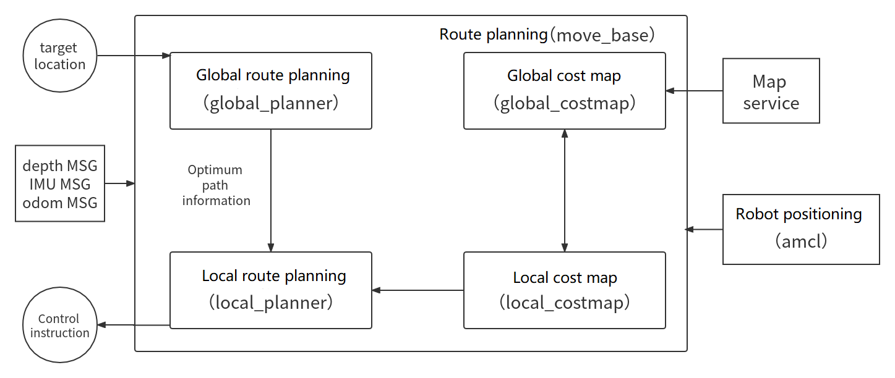

The robot only needs to publish the necessary sensor information and navigation goal position, and ROS can complete the navigation function. In this framework, the move_base package provides the main operation and interactive interface of navigation. In order to ensure the accuracy of the navigation path, the robot also needs to accurately locate its own position. This part of the function is implemented by the amcl package.

#### 6.1.1 Move_base package

move_base is a package for path planning in ROS, which is mainly composed of the following two planners.

Global path planning (global_planner). Global path planning is to plan the overall path according to a given goal position and global map. In navigation, Dijkstra or A* algorithm is used for global path planning, and the optimal route from the robot to the goal position is calculated as the robot's global path.

Local real-time planning (local_planner). In actual situations, robots often cannot strictly follow the global path, so it is necessary to plan the path that the robot should travel in each cycle according to the map information and obstacles that may appear near the robot at any time, so that it conforms to the global optimal path as much as possible.

#### 6.1.2 Amcl package

Autonomous positioning means that the robot can calculate its position on the map in any state. ROS provides developers with an adaptive (or kld sampling) Monte Carlo localization (amcl), which is a probabilistic positioning system that locates mobile robots in 2D. It implements an adaptive (or KLD-sampling) Monte Carlo localization, using particle filtering to track the pose of the robot on a known map.

#### 6.1.3 Introduction of DWA_planner and TEB_planner

DWA_planner

The full name of DWA is Dynamic Window Approaches. The algorithm can search for multiple paths to avoid and travel, select the optimal path based on various evaluation criteria (whether it will hit an obstacle, the time required, etc.), and calculate the linear velocity and angular velocity during the driving cycle to avoid collisions with dynamic obstacles.

TEB_planner

The full name of "TEB" is Time Elastic Band Local Planner. This method performs subsequent modifications to the initial trajectory generated by the global path planner to optimize the robot's motion trajectory and belongs to local path planning. In the process of trajectory optimization, the algorithm has a variety of optimization goals, including but not limited to: overall path length, trajectory running time, distance to obstacles, passing intermediate path points, and compliance with robot dynamics, kinematics, and geometric constraints. The“TEB method” explicitly considers the dynamic constraints of time and space in the state of motion, for example, the velocity and acceleration of the robot are limited.

### 6.2 Limo navigation function

**Note:** In the four-wheel differential mode, the omnidirectional wheel mode and the track mode, the  file run for the navigation is the same.

**Note:** Before running the command, please make sure that the programs in other terminals have been terminated. The termination command is: Ctrl+c.

（1）First launch the LiDAR and enter the command in the terminal:

```
roslaunch limo_bringup limo_start.launch pub_odom_tf:=false
```

（2）Launch the navigation function and enter the command in the terminal:

```
roslaunch limo_bringup limo_navigation_diff.launch
```

**Note:** If it is Ackermann motion mode, please run

```
roslaunch limo_bringup limo_navigation_ackeman.launch
```

After launching successfully, the rviz interface will be opened, as shown in the figure:


**Note:** If you need to customize the opened map, please open the limo_navigation_diff.launch file to modify the parameters; please modify map02 to the name of the map that needs to be replaced.


（3）After launching the navigation, you will find that the shape scanned by the laser does not  overlap with the map, and we need to manually correct it. Correct the actual position of the chassis in the scene on the map displayed in rviz. Use the tools in rviz to publish an approximate position, give the limo a rough position, and then use the handle to remotely rotate the limo to make it automatically correct. When the laser shape overlaps the scene shape in the map, the correction is complete. The operation steps are as follows:

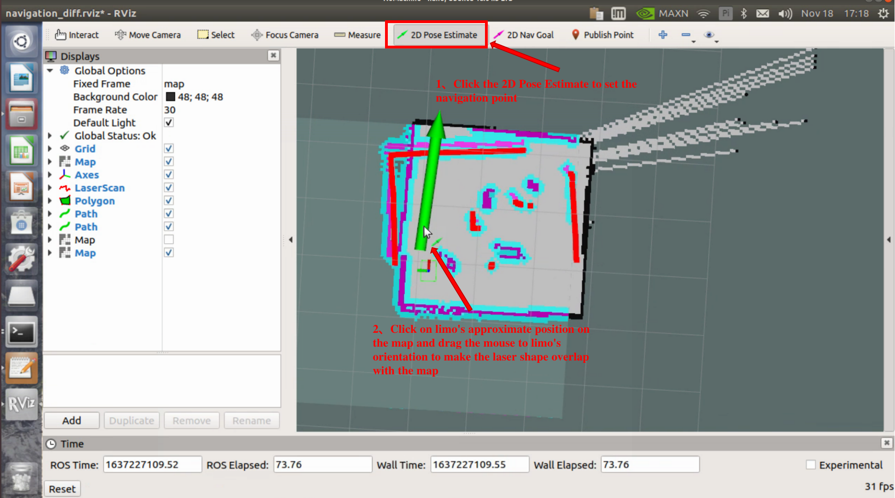

After the correction is complete:


（4）Set the navigation goal point through 2D Nav Goal.

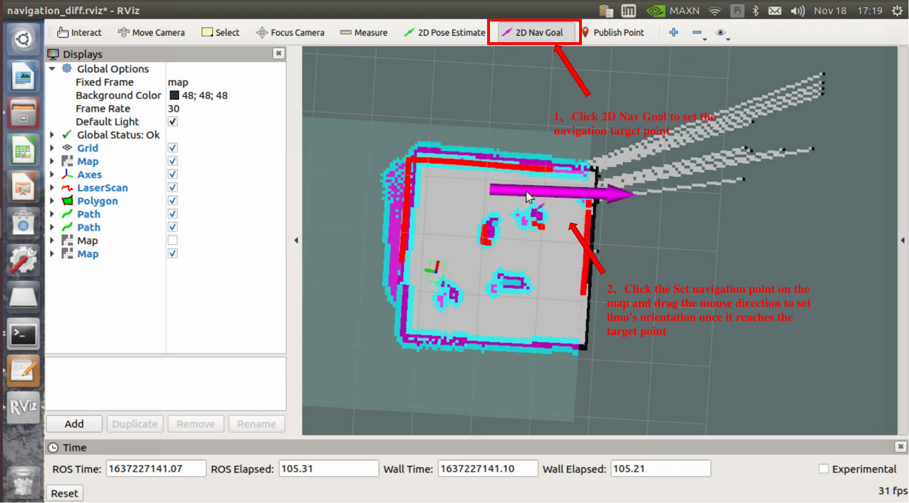

A purple path will be generated in the map, the handle will switch to command mode, and limo will automatically navigate to the goal point.

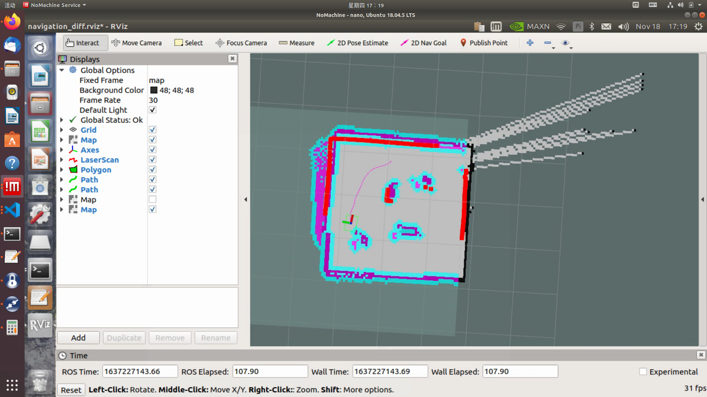

###  6.3 Limo path inspection

（1）First launch the LiDAR, open a new terminal, and enter the command in the terminal:

```
roslaunch limo_bringup limo_start.launch pub_odom_tf:=false
```

（2）Launch the navigation function, open a new terminal, and enter the command in the terminal:

```
roslaunch limo_bringup limo_navigation_diff.launch
```

**Note:** If it is Ackermann motion mode, please run

```
roslaunch limo_bringup limo_navigation_ackeman.launch
```

（3）Launch the path recording function, open a new terminal, and enter the command in the terminal:

```
roslaunch agilex_pure_pursuit record_path.launch
```

After the path recording is over, terminate the path recording program, and enter the command in the terminal: Ctrl+c.

（4）Launch the path inspection function, open a new terminal, and enter the command in the terminal:

**Note:** adjust the handle to command mode.

```
roslaunch agilex_pure_pursuit pure_pursuit.launch
```


##  7 Depth Camera + LiDAR Mapping

Limo has two versions, one with RealSense D435 and the other with ORBBEC®Dabai. Both depth cameras can realize the mapping and navigation function of vision + LiDAR. The following will introduce how to use two depth cameras.

### 7.1 Introduction and use of ORBBEC®Dabai

ORBBEC®Dabai is a depth camera based on binocular structured light 3D imaging technology. It mainly includes a left infrared camera (IR camera1), a right infrared camera (IR camera2), an IR projector and a depth processor. The IR projector is used to project the structured light pattern (speckle pattern) to the goal scene, the left infrared camera and the right infrared camera respectively collect the left infrared structured light image and the right infrared structured light image of the goal, and the depth processor executes the depth calculation algorithm and outputs the depth image of the goal scene after receiving the left infrared structured light image and the right infrared structured light image.

| **Parameter name**                                           | **Parameter index**                                          |
| ------------------------------------------------------------ | ------------------------------------------------------------ |
| The distance between the imaging centers of the left and right infrared cameras | 40mm                                                         |
| Depth distance                                               | 0.3-3m                                                       |
| Power consumption                                            | The average power consumption of the whole machine is <2W;The peak value at the moment the laser is turned on <5W (duration: 3ms);Typical standby power consumption is <0.7W. |
| Depth map resolution                                         | 640x400@30FPS; 320x200@30FPS                                 |
| Color map resolution                                         | 1920x1080@30FPS; 1280x720@30FPS; 640x480@30FPS               |
| Accuracy                                                     | 6mm@1m (81% FOV area participates in accuracy calculation*)  |
| Depth FOV                                                    | H 67.9° V 45.3°                                              |
| Color FOV                                                    | H 71° V43.7° @1920X1080                                      |
| Delay                                                        | 30-45ms                                                      |
| Data transmission                                            | USB2.0 or above                                              |
| Supported operating system                                   | Android / Linux / Windows7/10                                |
| Power supply mode                                            | USB                                                          |
| Operating temperature                                        | 10°C ~ 40°C                                                  |
| Applicable scene                                             | Indoor / outdoor (specifically subject to application scenes and related algorithm requirements) |
| Dustproof and waterproof                                     | Foundation dustproof                                         |
| Safety                                                       | Class1 laser                                                 |
| Dimensions (mm)                                              | Length 59.6 X width 17.4 X thickness 11.1mm                  |

After knowing the basic parameters of ORBBEC®Dabai, start to practice：

**Note:** Before running the command, please make sure that the programs in other terminals have been terminated. The termination command is: Ctrl+c

First ,start the ORBBEC®Dabai camera and run the following command:

```
roslaunch astra_camera dabai_u3.launch
```

The following warnings will appear during running. This is because some parameters in the driver are not supported by the camera and can be ignored.


### 7.2 Introduction and use of realsense

Binocular vision sensors have a wide range of application scenes and requirements in the robot vision measurement, visual navigation and other robotics industries. At present, we have selected the common vision sensors in the scientific research and education industry. The Intel RealSense Depth Camera D435 is equipped with a global image shutter and a wide field of view, which can effectively capture and stream the depth data of moving objects, thereby providing highly accurate depth perception for mobile prototypes.

|                              | **Model**                | Intel Realsense D435 |
| ---------------------------- | ------------------------ | -------------------- |
| Basic features               | Application scenes       | Outdoor/indoor       |
| Measuring distance           | About 10m                |                      |
| Depth shutter type           | Global shutter/3um X 3um |                      |
| Whether the IMU is supported | No                       |                      |
| Depth camera                 | In-depth technology      | Active infrared      |
| FOV                          | 86° x 57°（±3°）         |                      |
| Minimum depth distance       | 0.105m                   |                      |
| Depth resolution             | 1280 x 720               |                      |
| Maximum measuring distance   | About 10m                |                      |
| Depth frame rate             | 90 fps                   |                      |
| RGB                          | Resolution               | 1280 x 800           |
| FOV                          | 69.4° × 42.5°（±3°）     |                      |
| Frame rate                   | 30fps                    |                      |
| Other information            | Dimensions               | 90mm x 25mm x 25mm   |
| Interface type               | USB-C 3.1                |                      |

After knowing the basic parameters of realsense, start to practice:

 **Note:** Before running the command, please make sure that the programs in other terminals have been terminated.The termination command is: Ctrl+c.

First start the realsense camera and run the following command:

```
roslaunch realsense2_camera rs_camera.launch
```

When the following log information appears in the terminal, the camera is launched successfully.

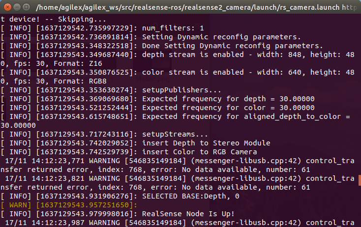

### 7.3 View information of depth camera

After successfully opening the depth camera, launch rviz to view the images captured by the depth camera and the depth information collected.

Open a new terminal and enter the command:

```
rviz
```

Then add the Image component to see the picture taken by the camera. The operation steps are as follows.


Select camera_link in fixed frame.


Fill in the corresponding topic in the image component to get the rgb picture.


After completing the above operations, you can see the picture taken by the camera in the Image window.


If you want to view the point cloud data, click “add” to add the DepthCloud component.


Select camera_link in fixed frame and select the corresponding topic in DepthCloud component.

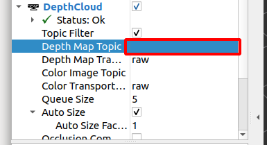

Show depth map:

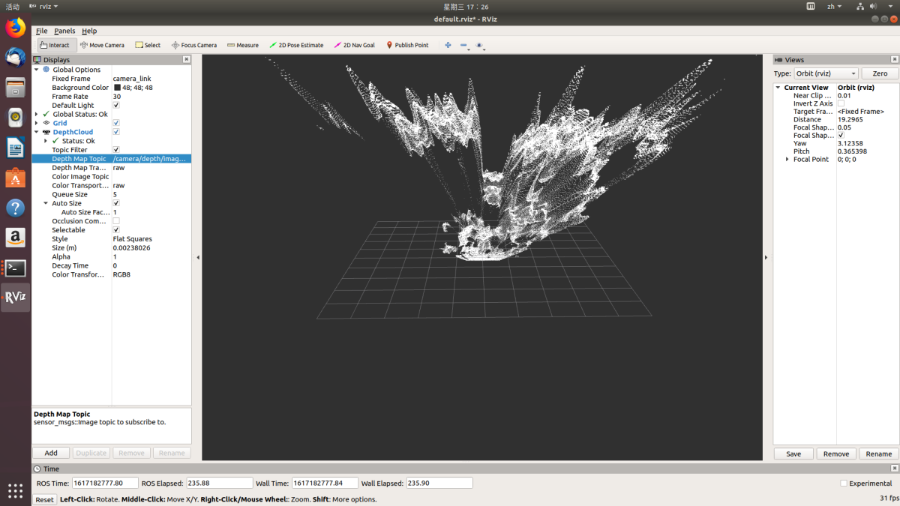

### 7.2 Introduction of rtabmap algorithm

The rtabmap algorithm provides an appearance-based positioning and mapping solution independent of time and scale. It's aimed at solving the problem of online closed-loop detection in large-scale environments. The idea of the solution is to meet some real-time limitations. Closed-loop detection uses only a limited number of positioning points, while being able to access the positioning points of the entire map when needed.

### 7.3 Rtabmap algorithm mapping

Note: Before running the command, please make sure that the programs in other terminals have been terminated. The termination command is: Ctrl+c.

Note: The speed of limo should be as slow as possible in the process of mapping. If the speed is too fast, the effect of mapping will be affected.

（1）First launch the LiDAR and enter the command in the terminal:

```
roslaunch limo_bringup limo_start.launch pub_odom_tf:=true
```

（2）Launch realsense and enter the command in the terminal:

```
roslaunch realsense2_camera rs_camera.launch align_depth:=true
```

**Note:** If limo is equipped with ORBBEC®Dabai, please enter the command:

```
 roslaunch astra_camera dabai_u3.launch 
```

（3）Launch the mapping mode of the rtabmap algorithm, and enter the command in the terminal:

```
roslaunch limo_bringup limo_rtabmap_realsense.launch
```

**Note:** If limo is equipped with ORBBEC®Dabai, please enter the command:

```
roslaunch limo_bringup limo_rtabmap_orbbec.launch
```

（4）Launch rviz to view the mapping effect, and enter the command in the terminal:

```
 roslaunch limo_bringup rtabmap_rviz.launch 
```

When the picture shown in the figure appears in the rviz interface, the rtabmap algorithm mapping mode is successfully launched.

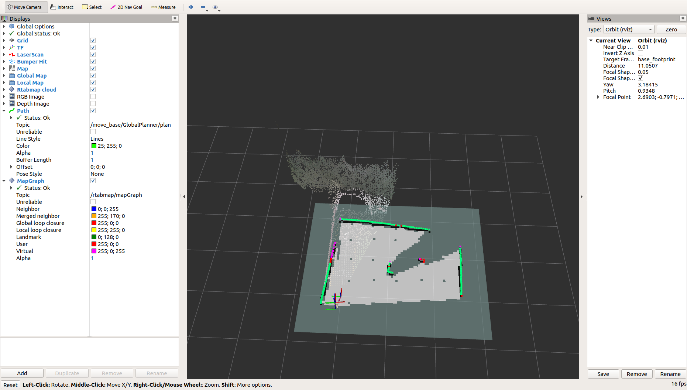

After the map is built, you can directly terminate the program, and the built map will be automatically saved in the .ros file in the main directory, and the file name is rtabmap.db. The .ros folder is a hidden folder and needs to be displayed through the Ctrl+h command.

### 7.4 Rtabmap algorithm navigation

**Note:** Before running the command, please make sure that the programs in other terminals have been terminated. The termination command is: Ctrl+c.

（1）First launch the LiDAR and enter the command in the terminal:

```
roslaunch limo_bringup limo_start.launch pub_odom_tf:=true
```

（2）Launch realsense and enter the command in the terminal:

```
roslaunch realsense2_camera rs_camera.launch align_depth:=true
```

**Note:** If limo is equipped with ORBBEC®Dabai, please enter the command:

```
 roslaunch astra_camera dabai_u3.launch 
```

（3）Launch the positioning mode of the rtabmap algorithm, and enter the command in the terminal:

```
roslaunch limo_bringup limo_rtabmap.launch localization:=true
```

**Note:** If limo is equipped with ORBBEC®Dabai, please enter the command:

```
roslaunch limo_bringup limo_rtabmap_orbbec.launch localization:=true
```

（4）Launch move_base and enter the command in the terminal:

```
roslaunch limo_bringup limo_navigation_rtabmap.launch
```

**Note:** If it is Ackermann motion mode, please run:

```
roslaunch limo_bringup limo_navigation_rtabmap_ackerman.launch
```

（5）Launch rviz to view the mapping effect, and enter the command in the terminal:

```
 roslaunch limo_bringup rtabmap_rviz.launch 
```

（6）Since we use visual positioning, no correction is needed when navigating with rtabmap. You can directly start to set the goal point for navigation. The operation steps are shown in the figure.

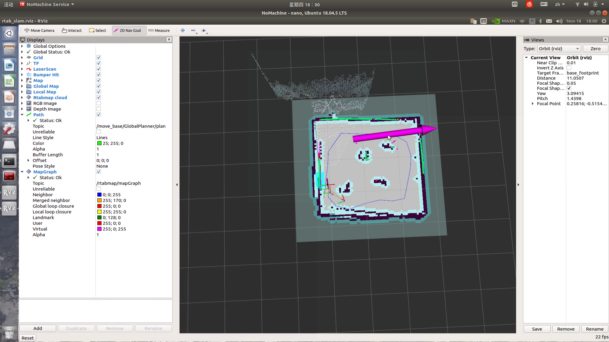

A green path will be generated in the map, the handle will switch to command mode, and limo will automatically navigate to the goal point.


 

## 8 Vision Module

### 8.1 Recognize text

#### 8.1.1  Function Introduction

Obtain the rgb image of the camera, perform grayscale and binarization processing on the image, and then use the pytesseract text recognition library to recognize the English letters or numbers of the image, and post the recognition result to the detect_word_reslut topic.

#### 8.1.2 Running function

**Note:** Before running the command, please make sure that the programs in other terminals have been terminated. The termination command is: Ctrl+c

Take Realsense as an example, launch node management, and enter the command in the terminal:

```
roscore
```

Start the text recognition function and enter the command in the terminal:

```
rosrun vision detect_node.py
```

Execute rostopic echo /detect_word_reslut to view the recognized results.

```
rostopic echo /detect_word_reslut
```

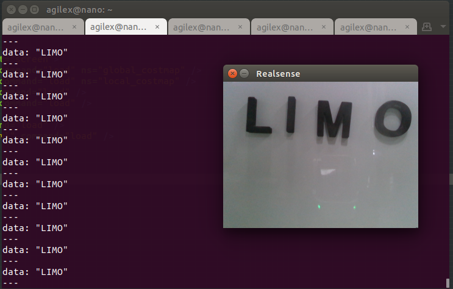

 

### 8.2 Identifying traffic lights

#### 8.2.1 Function introduction

After the traffic lights are detected through darknet_ros, the traffic lights must be identified and positioned in the three-dimensional space to generate the relative position of the object to the camera. This method can only realize the identification and positioning of the traffic lights, and cannot obtain the status of the traffic lights. Depth camera is needed, and its recognition distance depends on the depth camera’s range.

#### 8.1.2 Running function

Note: Before running the command, please make sure that the programs in other terminals have been terminated. The termination command is: Ctrl+c.

Take Realsense as an example, launch the realsense depth camera and enter the command in the terminal:

```
 roslaunch realsense2_camera rs_camera.launch
```

**Note:** If limo is equipped with ORBBEC®Dabai, please enter the command:

```
 roslaunch astra_camera dabai_u3.launch 
```

Launch yolo_v3 and enter the command in the terminal:

```
 roslaunch darknet_ros  yolo_v3_tiny.launch
```

Launch the traffic light recognition function:

```
 roslaunch vision traffic_light_located.launch
```


 

## 9 Voice module

### 9.1 Speech converted to text

#### 9.1.1 Function introduction

The voice is recorded into a wav file through the external sound card of the nano, and the voice recognition is realized with the voice library pocketsphinx, which can be recognized offline. This function has a high recognition rate for English, but a poor recognition rate for Chinese. 

#### 9.1.2 Running function

**Note:** Before running the command, please make sure that the programs in other terminals have been terminated. The termination command is: Ctrl+c.

Enter the following command in the terminal. When “recording” appears in the terminal, start to record the voice. After 3 seconds, the recording is complete, and “Done” will appear on the terminal.

```
rosrun voice  demo_record_voice.py 
```


After the voice is recorded, enter the command in the terminal:

```
rosrun voice  demo_voice2word.py output.wav
```


 

###  9.2 Voice control

#### 9.2.1 Function Introduction

Control limo to move ahead, move back, turn right, and turn left by saying ahead, back, right and left to limo. 

#### 9.2.2 Running function

Note: Before running the command, please make sure that the programs in other terminals have been terminated. The termination command is: Ctrl+c.

1. Launch the chassis node, and adjust the handle to the command mode after the chassis node is launched.

```
 roslaunch limo_base limo_base.launch 
```

2. Launch the voice control node. After launching, the interface shown in the figure below will appear. Enter 1 and press Enter to enter the voice recording mode and control limo; enter q to quit.

```
rosrun voice voice_ctr_node.py 
```


## Appendix

### Appendix 1. Three Views


### Appendix 2. Basic Operating Commands

#### 2.1 Directory operating commands

##### (1) Directory switch: cd

① cd /     switch to the root directory

② cd /usr     switch to the usr directory under the root directory

③ cd ../     switch to the upper level directory or cd  ..

④ cd ~     switch to the home directory

⑤ cd -     switch to the last visited directory

##### (2) Directory view: ls

① ls: view all directories and files in the current directory

② ls -a: view all directories and files in the current directory (including hidden files)

③ ls -l or ll: list view all directories and files in the current directory (list view, which displays more information)

④ ls /dir: view all directories and files in the specified directory, like: ls /usr

##### (3) Create directory: mkdir

① mkdir aaa: create a directory named aaa in the current directory

② mkdir /usr/aa: create a directory named aaa in the specified directory

##### (4) Show hidden directory: Ctrl+h

In the folder, you can display the hidden folders in the folder by Ctrl+h

##### (5)Terminate program: Ctrl+c

Enter the command Ctrl+c in the terminal to forcefully terminate the program being executed

#### 2.2 ROS commonly used commands

(1) Compile command: catkin_make

Used to compile packages in the entire workspace

(2) Initialize workspace: catkin_init_workspace

Used to initialize the workspace when creating the workspace for the first time

(3) Create package: catkin_create_pkg

Used to create a package, and its syntax is:

```
 catkin_create_pkg <package_name> [depend1] [depend2] [depend3]...
```

##### （4）Node running command

​    ① rosrun is used to run the .cpp files and the .py files, and its syntax is:

```
	rosrun package_name node_name
```

​	② roslaunch is used to run .launch files. In the launch files, the .cpp files and the .py files can be called at the same time, and its syntax is:

```
	roslaunch package_name node_name
```


### Appendix 3. ROS Framework

#### 3.1 ROS architecture design

The ROS architecture is as shown in the figure below, which can be divided into three layers: OS layer, middle layer and application layer.


（1） OS layer

ROS is not an operating system in the traditional sense. It cannot run directly on computer hardware like Windows and Linux. Instead, it needs to rely on the Linux system. So at the OS layer, we can directly use the Ubuntu operating system with the best official support of ROS, or use macOS, Arch, Debian and other operating systems.

(2) Middle layer

Linux is a general system and does not provide special middleware for robot development, so ROS has done a lot of work in the middle layer, the most important of which is the communication system based on TCPROS/UDPROS. The ROS communication system is based on the TCP/UDP network, on which it is re-encapsulated, that is, TCPROS/UDPROS. The communication system uses publish/subscribe, client/server and other models to realize data transmission through multiple communication mechanisms.

In addition to the communication mechanism of TCPROS/UDPROS, ROS also provides an in-process communication method——Nodelet, which can provide a more optimized data transmission method for multi-process communication, which is suitable for applications that have higher requirements for real-time data transmission.

On top of the communication mechanism, ROS provides a large number of libraries related to robot development, such as data type definition, coordinate transformation, motion control, etc., which can be provided to the application layer.

(3) Application layer

At the application layer, ROS needs to run a manager——Master, responsible for managing the normal operation of the entire system. A large number of robot application packages are shared in the ROS community. The modules in these packages run as nodes and use ROS standard input and output as interfaces. Developers do not need to pay attention to the internal implementation mechanism of the modules, but only need to understand the interface rules to achieve reuse, which greatly improves development efficiency.

From the perspective of system implementation, ROS can also be divided into three layers as shown in the following figure: file system, computation graph, and open source community.


#### 3.2 Computation graph

From the perspective of the computation graph, the functional modules of the ROS system software run independently in units of nodes, which can be distributed in multiple same or different hosts, and are connected through an end-to-end topology when the system is running.

##### 3.2.1 Nodes

Nodes are processes that perform computing tasks. A system generally consists of multiple nodes, which can also be called "software modules." The introduction of the node concept makes the ROS-based system more vivid at runtime: When many nodes are running at the same time, it is easy to draw the end-to-end communication into the node diagram as shown below, in which the process is the node, and the end-to-end connection is the connecting line between the nodes.


##### 3.2.2 Message

The most important communication mechanism between nodes is the message communication based on the publish/subscribe model. Each message is a strict data structure, which supports standard data types (integer, floating point, Boolean, etc.), as well as nested structures and arrays (similar to the structure of C language), and can also be independently defined by the developer according to requirements.

##### 3.2.3 Topic

Messages are delivered in a Publish/Subscribe manner (see the figure below). A node can publish a message for a given Topic (called Talker), or it can follow a topic and subscribe to a specific type of data (called Listener). Talkers and Listeners do not know each other's existence. There may be multiple nodes in the system simultaneously publishing or subscribing to the same topic.


##### 3.2.4 Service

Although the topic-based publish/subscribe model is a very flexible communication mode, it is not suitable for the two-way synchronous transmission mode. In ROS, we call this synchronous transmission mode Service, which is based on the Client/Server model and contains two parts of communication data types: one for request and the other for response, similar to a Web server. Different from the topic, only one node is allowed to provide the specified naming service in ROS.

3.2.5 Master

In order to manage the above concepts as a whole, there needs to be a controller in the system to make all nodes execute in an orderly manner. This is the ROS Master. ROS Master provides registration lists and search functions for other computation graphs through remote procedure call (RPC), helps ROS nodes to find and establish connections with each other, and also provides a parameter server for the system to manage global parameters. ROS Master is a manager. Without it, nodes will not be able to find each other, exchange messages or call services, and the entire system will be paralyzed. This shows its importance in the ROS system.

#### 3.3 File system

Similar to the operating system, ROS organizes all files according to certain rules, and files with different functions are placed in different folders, as shown in Figure 2-5.

Package: The package is the basic unit of ROS software, including ROS nodes, libraries, configuration files, etc.

Package Manifest: Each package contains a package manifest named package.xml, which is used to record the basic information of the package, including author information, license information, dependent options, compilation flags, etc.

Meta Package: In the new version of ROS, the concept of the original Stack is upgraded to "Meta Package", whose main function is to organize multiple packages for the same purpose. For example, a ROS navigation meta package will contain multiple packages such as modeling, positioning, and navigation.

Meta Package Manifest: Not shown in the figure below. It is similar to the package manifest. The difference is that the meta package manifest may contain packages that need to be relied upon at runtime or tags for declaring some references.

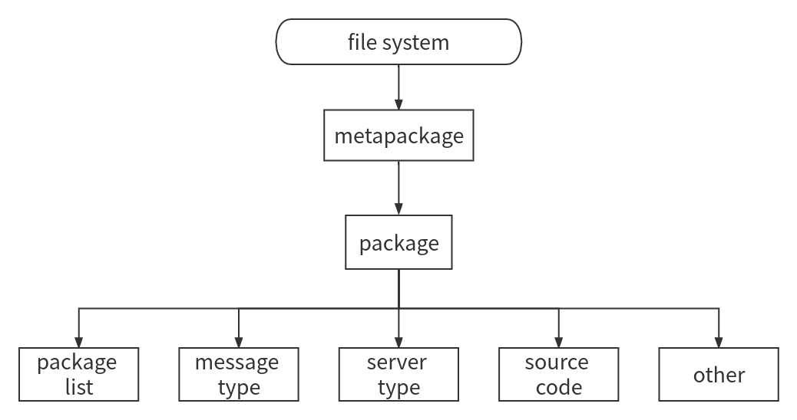

Message type: Message is the communication information published/subscribed between ROS nodes. You can use the message type provided by ROS, or you can use the .msg file to customize the required message type in the msg folder of the package.

Service type: The service type defines the request and response data type under the ROS client/server communication model. You can use the service types provided by the ROS system; you can also use the .srv file to define in the srv folder of the package.

Code: The folder used to place the source code of the package node.


#### 3.4 Open source community

The resources in the ROS open source community are very rich, and the following software and knowledge can be shared through the network (see Figure 2-9).

Distribution: Similar to the Linux distribution, the ROS distribution includes a series of packages with version numbers that can be installed directly. This makes ROS’s software management and installation easier, and it can maintain a unified version number through software collections.

Repository: ROS relies on the open source code on the shared network, and different organizations can develop or share their own robotic software.

ROS wiki: The main forum for documenting ROS information. Everyone can register, log in to the forum, upload their own development documents, update, and write tutorials.

Mailing List: The ROS mailing list is the main channel for communicating ROS updates, as well as various questions about ROS development.

ROS Answers: ROS Answers is a website for inquiring about ROS related questions. Users can submit their own questions on this website and get answers from other developers.

Blog: Publish news, pictures, and videos in the ROS community (http：//[www.ros.org/news](http://www.ros.org/news)).

#### 3.5 Communication mechanism

ROS is a distributed framework that provides users with communication services between multiple nodes (processes). All software functions and tools are based on this distributed communication mechanism, so the ROS communication mechanism is the lowest and most core technology. In most application scenes, although we don't need to pay attention to the implementation mechanism of the underlying communication, understanding its related principles will definitely help us make better use of ROS in the development process. The three core communication mechanisms of ROS are introduced below.

3.5.1 Topic communication mechanism

Topic is used most frequently in ROS, and its communication model is also more complicated. As shown in the figure below, there are two nodes in ROS: one is Talker, and the other is Listener. Two nodes publish and subscribe to the same topic separately. There is no mandatory requirement for the startup sequence. Here, assuming that Talker starts first, it can be divided into the seven steps shown in the figure to analyze the detailed process of establishing communication.


1.Talker registration

Talker starts and uses RPC to register Talker's information with ROS Master through port 1234, including the topic name of the published message; ROS Master will add the registration information of the node to the registration list.

2. Listener registration

The Listener starts and also registers Listener’s  information with ROS Master through RPC, including the topic name that needs to be subscribed.

3. ROS Master performs information matching

The Master searches the registration list based on the subscription information of the Listener. If no matching Talker is found, it waits for the Talker to join; if it finds the matching Talker information, it sends the Talker's RPC address information to the Listener via RPC.

4. Listener sends a connection request

The Listener receives the Talker address information sent back by the Master, and tries to send a connection request to the Talker via RPC, and transmits the topic name, message type and communication protocol (TCP/UDP) subscribed to.

5. Talker confirms the connection request

After the Talker receives the connection request sent by the Listener, it continues to confirm the connection information to the Listener via RPC, which contains its own TCP address information.

6. Listener tries to establish a network connection with Talker

After the Listener receives the confirmation message, it uses TCP to try to establish a network connection with the Talker.

7. Talker publishes data to Listener

After successfully establishing a connection, Talker starts to send topic message data to Listener.

From the above analysis, it can be found that the communication protocol used in the first five steps is RPC, and TCP is used only in the process of publishing data.

ROS Master plays an important role in the process of establishing connections between nodes, but does not participate in the final data transmission between nodes.

After the nodes have established a connection, you can turn off the ROS Master, and the data transmission between the nodes will not be affected, but other nodes cannot join the network between the two nodes.

3.5.2 Parameter management mechanism

The parameters are similar to global variables in ROS and are managed by ROS Master. Their communication mechanism is relatively simple and does not involve TCP/UDP communication, as shown in the figure below.


1.Talker sets variables

The Talker uses RPC to send parameter setting data to ROS Master, including parameter names and parameter values; ROS Master saves the parameter names and parameter values in the parameter list.

2. Listener searches parameter values

The Listener sends a parameter search request to the ROS Master via RPC, including the parameter name to be searched.

3. ROS Master sends parameter values to Listener

The Master searches the parameter list according to the Listener's search request. After finding the parameters, it uses RPC to send the parameter values to the Listener.

It should be noted here that if the Talker updates the parameter values to the Master, the Listener cannot know that the parameter values have been updated without searching the parameter values again. Therefore, in many application scenes, a dynamic parameter update mechanism is required. Chapter 12 will specifically explain the implementation of the dynamic parameter configuration function in ROS.

### Appendix 4. ROS Basics

#### 4.1 Workspace

The main method of using ROS to realize robot development is of course to write code, so these code files need to be placed in a fixed space, that is, the workspace.

4.1.2 What is a workspace

Workspace is a folder for storing project development related files. ROS after the Fuerte version uses the Catkin compilation system by default. The workspace structure under a typical Catkin compilation system is as follows.

A typical workspace generally includes the following four directory spaces.

(1) src: code space, the most commonly used folder in the development process, used to store the source code files of all ROS packages.

(2) build: compilation space, used to store the cache information and intermediate files generated during the compilation of the workspace.

(3) devel: development space, used to place executable files generated by compilation.

(4) lib: installation library space. After the compilation is successful, you can use the make install command to install the executable files into the space, and run the environment variable scripts in the space to run these executable files in the terminal. The installation library space is not necessary, and this folder may not be available in many workspaces.

4.2.2 Create a workspace

The command to create a workspace is relatively simple. First, use the system command to create the workspace directory, and then run the ROS workspace initialization command to complete the creation process:

Create a folder named catkin_ws and continue to create a folder named src under catkin_ws

```
 mkdir -p ~/catkin_ws/src
```

Switch to the src folder under the catkin_ws folder

```
 cd ~/catkin_ws/src
```

Initialize the folder

```
 catkin_init_workspace
```

After the creation is complete, you can use the catkin_make command to compile the entire workspace in the root directory of the workspace:  

Switch to the catkin_ws folder:

```
cd ~/catkin_ws/
```

Run the compile command

```
 catkin_make
```

During the compilation process, two folders, build and devel, and their files will be automatically generated in the root directory of the workspace. After the compilation is complete, several environment variable setting scripts in the form of setup.*sh have been generated in the devel folder. Use the source command to run these script files, then the environment variables in the workspace can take effect.

```
 source devel/setup.bash
```

In order to ensure that the environment variables have taken effect, you can use the following command to check:

```
 echo $ROS_PACKAGE_PATH
```

If the printed path already contains the path of the current workspace, it means that the environment variable is set successfully (see the figure below).


The environment variables set by the source command in the terminal can only be effective in the current terminal. If you want the environment variables to be effective in all terminals, you need to add the environment variable settings in the terminal configuration file:

```
echo"source/WORKSPACE/devel/setup.bash">>~/.bashrc
```

Please use the workspace path instead of WORKSPACE.

##### 4.2.3 Create a package

The form of the package in ROS is as follows:

```
my_package/
	CMakeLists.txt
	package.xml

	......
```

The package.xml file provides meta-information of the package, that is, information describing the attributes of the package. The CMakeLists.txt file records the compilation rules of the package.

ROS does not allow other packages to be nested in a certain package, and multiple packages must be placed in parallel in the code space.

ROS provides the command catkin_create_pkg to directly create a package. The usage of this command is as follows:

```
 catkin_create_pkg <package_name> [depend1] [depend2] [depend3]...
```

When running the catkin_create_pkg command, the user needs to enter the package name and the names of other packages that it depends on (depend1, depend2, depend3). For example, we need to create a learning_limo package, which depends on std_msgs, roscpp, rospy and other packages.

First enter the code space and use the catkin_create_pkg command to create a package:

Switch to the src folder under the catkin_ws folder

```
cd ~/catkin_ws/src
```

Run the command to create the package.

```
catkin_create_pkg learning_limo std_msgs rospy roscpp
```

After the creation is complete, a learning_limo package will be generated in the code space src, which already contains the package.xml and CMakeLists.txt files.

Then go back to the root directory of the workspace to compile and set the environment variables: 

Switch to the catkin_ws folder:

```
cd ~/catkin_ws
```

Run the compile command:

```
 catkin_make
```

Set environment variables

```
source ~/catkin_ws/devel/setup.bash
```

The above is the basic process of creating a package.

Note: In the same workspace, no package with the same name is allowed, otherwise an error will be reported during compilation.

#### 4.3 Write package to control limo

To use topic communication mechanism to control the movement of limo, you need to write two nodes, Publisher and Subscriber. Publisher is responsible for issuing speed control instructions to limo, and Subscriber is responsible for monitoring the speed received by limo.

4.3.1 How to create Publisher

The main role of Publisher is to publish messages of specific data types for specific topics. We try to use code to implement a node, create a Publisher in the node and control the movement of limo. The source code file’s location is 

~/agilex_ws/src/limo_ros/learning_limo/src/talker.cpp, and its contents are as follows:

```
#include <sstream>
#include "ros/ros.h"
#include "std_msgs/String.h"
#include <geometry_msgs/Twist.h>

int main(int argc, char **argv)
{
    // The ROS node is initialized
    ros::init(argc, argv, "talker");

	// Create a node handle
	ros::NodeHandle n;

	// Create a Publisher and publish a topic called Chatter with a message type geometry_MSgs ::Twist
	ros::Publisher chatter_pub = n.advertise<geometry_msgs::Twist>("cmd_vel", 1000);

	//Set the frequency of the loop
	ros::Rate loop_rate(10);

   for ( int count = 0; count<10;count++ )
   {
   //Set the speed at which you want to publish
    geometry_msgs::Twist twist;
    geometry_msgs::Vector3 linear;
    linear.x=0.1;
    linear.y=0;
    linear.z=0;
    geometry_msgs::Vector3 angular;
    angular.x=0;
    angular.y=0;
    angular.z=0;
   
   //Assign the set speed to Twist
    twist.linear=linear;
    twist.angular=angular;

	//Publish the set speed
    chatter_pub.publish(twist);

    // Loop waiting for the callback function
    ros::spinOnce();

    // According to the cycle frequency delay
    loop_rate.sleep();

   }

return 0;

}

```

##### 4.3.2 How to create a Subscriber

Next, we try to create a Subscriber to subscribe to the control command published by the Publisher node. The source code file’s location is

~/agilex_ws/src/limo_ros/learning_limo/src/listener.cpp，and its contents are as follows:

```
#include "ros/ros.h"
#include "std_msgs/String.h"
#include <geometry_msgs/Twist.h>

// Upon receiving the subscribed message, the message callback function is entered
void chatterCallback(const geometry_msgs::TwistConstPtr& msg )
{
	// Extract data from MSG and assign values
    double x = msg->linear.x;
    double y = msg->linear.y;
    double z = msg->angular.z;
    
    // Print the received message
    ROS_INFO("I get x: [%f]", x);
    ROS_INFO("I get y: [%f]", y);
    ROS_INFO("I get z: [%f]", z);
    
}

int main(int argc, char **argv)
{
    // Initialize the ROS node
    ros::init(argc, argv, "listener");

// Create a node handle
ros::NodeHandle n;

// Create a Subscriber, subscribe to a topic called Chatter, and register the callback function chatterCallback
ros::Subscriber sub = n.subscribe("cmd_vel", 1000, chatterCallback);

// Loop waiting for the callback function
ros::spin();

return 0;

}
```

##### 4.3.3 Compile package

The code of the node has been completed. C++ is a compiled language. You need to compile the code into an executable file before running. If you use a parsing language like Python to write the code, you do not need to compile and you can skip this step.

The compiler in ROS uses CMake. The compilation rules are set through the CMakeLists.txt file in the package. This file will be automatically generated in the package created by the catkin command. Most compilation options have been configured and detailed comments are included. We hardly need to check the relevant manuals, and we can compile our own code with a little modification.

Open the CMakeLists.txt file in the package, find the following configuration items, remove the comments and make slight modifications:

```
include_directories(include ${catkin_INCLUDE_DIRS})

add_executable(talker src/talker.cpp)
target_link_libraries(talker ${catkin_LIBRARIES})
add_dependencies(talker ${PROJECT_NAME}_generate_messages_cpp)

add_executable(listener src/listener.cpp)
target_link_libraries(listener ${catkin_LIBRARIES})
add_dependencies(talker ${PROJECT_NAME}_generate_messages_cpp)
```

##### 4.3.4 Run Publisher and Subscriber

After the compilation is complete, we can finally run the Publisher and Subscriber nodes. Before running the nodes, you need to set the environment variables in the terminal, otherwise the executable file generated by the final compilation of the package cannot be found:

Switch to the catkin_ws directory

```
 cd ~/catkin_ws
```

Set environment variables

```
source ./devel/setup.bash
```

You can also add the configuration script of environment variables to the configuration file of the terminal:

```
echo "source ~/catkin_ws/devel/setup.bash" >> ~/.bashrc
source ~/.bashrc
```

In limo, the environment variables have been set, and you can start the routine according to the following steps:

1. Launch the chassis node

**Note:** Before running the command, please make sure that the programs in other terminals have been terminated. The termination command is: Ctrl+c.

Before running the node, you first need to ensure that the chassis node has been successfully launched:

```
roslaunch limo_base limo_base.launch 
```

2.Launch Subscriber

First use the rosrun command to launch the Subscriber node and subscribe to the news about to be published by Publisher:

```
rosrun learning_limo listener 
```

If the message is successfully subscribed, the content of the received message will be displayed in the terminal.

3. Launch Publisher

Next use the rosrun command to launch Publisher:

```
rosrun learning_limo talker
```

If the Publisher node is running normally, the vehicle will move and the Subscriber node will also receive the message.

##### 4.4 ROS common components

4.4.1Launch File

The Launch File is a way to launch multiple nodes at the same time in ROS. It can also automatically start the ROS Master, and can realize various configurations of each node, which provides great convenience for the operation of multiple nodes.

(1) Launch tag

The launch tag is like a generous bracket that defines an area. All launch files start with < launch> and end with < /launch>. All description tags must be written between < launch> and < /launch>

```
<launch>
……
……
</launch>
```

（2）Node tag

The node tag can be said to be the most common tag in the launch file. Each node tag includes the name attribute of the node in the ROS graph (name), the package name where the node is located (pkg), and the type of the node (type). The common usage is as follows:

```
<node pkg="package-name" type="executable-name" name="node-name" />
```

| **Tag attribute**  | **Attribute function**                                       |
| ------------------ | ------------------------------------------------------------ |
| name="NODE_NAME"   | Assign a name to the node, which will override the node_name defined by ros::init() |
| pkg="PACKAGE_NAME" | The name of the package where the node is located            |
| type="FILE_NAME"   | Define the executable file name of the node                  |
| output="screen"    | Print the standard output of the node to the terminal screen, and the default output is a log file. |
| respawn="true"     | Reset the properties. When the node stops, it will automatically restart. The default is false. |
| ns = "NAME_SPACE"  | Namespace, which adds a namespace prefix to the relative name in the node. |
| args="arguments"   | Input parameters required by the node.                       |

（3）Include tag

This tag can import another roslaunch XML file to the current file.

| **Tag attribute**                          | **Attribute function**                |
| ------------------------------------------ | ------------------------------------- |
| file ="$(find pkg-name)/path/filename.xml" | Specify the files you want to include |

Use it like this：

```
<include file="$(find demo)/launch/demo.launch" />
```

（4）Remap tag

As the name implies, the remap tag is remapping. ROS supports topic remapping. The remap tag contains an original-name and a new-name.

For example, now you get a node that subscribes to the "/chatter" topic, but the node you write can only be published to the "/demo/chatter" topic. Since the message types of these two topics are the same, if you want these two nodes to communicate, you can write this in the launch file:

```
<remap from="chatter" to="demo/chatter"/>
```

In this way, you can directly remap /chattertopic to /demo/chatter, so that the two nodes can communicate without modifying any code.

（5）Param tag

The role of the param tag is equivalent to the rosparam set in the command line.

For example, now add a parameter named demo_param with a value of 1.0 in the parameter server.

```
<param name="demo_param" type="int" value="1.0"/>
```

（6）Rosparam tag

The rosparam tag allows a large number of parameters to be imported from the YAML file at once.

```
<rosparam command="load" file="$(find pkg-name)/path/name.yaml"/>
```

（7）Arg tag

Argument is another concept, similar to the local variables in the launch file. It is limited to the launch file and facilitates the reconstruction of the launch file. It has nothing to do with the internal implementation of the ROS node.

Set argument to use the arg tag element, and the syntax is as follows:

```
<arg name="arg-name" default= "arg-value"/>
```

##### 4.4.2 Rviz

Rviz is a 3D visualization tool, which is well compatible with various robot platforms based on ROS software framework. In rviz, you can use XML to describe the size, quality, position, material, joints and other attributes of any physical objects such as robots and surrounding objects, and present them in the interface. At the same time, rviz can also graphically display the information of the robot's sensors, the robot's motion status, and the changes in the surrounding environment in real time. All in all, rviz can help developers realize the graphical display of all monitorable information. Developers can also control the behavior of the robot through buttons, sliders, and values under the control interface of rviz. The following figure shows the raster map and laser data graphically displayed by rviz during the map building. 


##### 4.4.3 Qt toolbox

Computation graph visualization tool (rqt_graph)

The rqt_graph tool can graphically display the computation graph in the current ROS system. When running the mapping function, use the following command to launch the tool:

```
rqt_graph
```

The computation graph after successful launch is shown in the figure below.

 


TF relationship visualization tool (rqt_tf_tree)

The rqt_tf_tree tool can graphically display the TF relationship between the currently running nodes. When running the mapping function, use the following command to launch the tool:

```
rosrun rqt_tf_tree rqt_tf_tree 
```

The TF relationship diagram after successful launch is shown in the figure below:


### Appendix 5 System Burning

#### 5.1 Download and install balenaetcher

Download and install balenaetcher on a PC; download link: https://www.balena.io/etcher/; download different versions according to the operating system and architecture of the PC.

#### 5.2 Download the image to be burned

Here is an example of the official image provided by our company. Use Baidu cloud disk to download the image, and the download link is:https://pan.baidu.com/s/1MyyAR4y-Umyf_OwMk-rinA Extract the code: 50d9 

#### 5.3 Instructions on software usage

The instructions on software usage in the Linux system are taken as an example.

1. Open the software and select the image to be burned


2. Select the SD card that needs to be burned

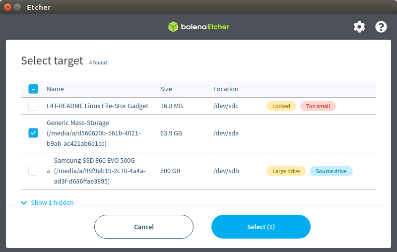

3. Click Flash to start burning


### Appendix 6  Firmware Upgrade

The firmware upgrade software is in the main directory of limo, and the file name is LimonTest_Nano. The firmware required for the upgrade is in our official GitHub, and the link is: https://github.com/agilexrobotics/limo-doc.

**Note:** If LimonTest_Nano in limo cannot be opened normally, please download the latest software from our official GitHub, and the link is: https://github.com/agilexrobotics/limo-doc

After downloading the firmware that needs to be upgraded, then start the operation steps:

#### 1. Enter the firmware upgrade mode

In the shutdown state, press the power button twice to enter the firmware upgrade mode. When the power button flashes, it enters the firmware upgrade mode successfully. After a few seconds, nano will start normally.

#### 2. Grant LimonTest_Nano software running permissions

Open the terminal and enter the command in the terminal:

```
chmod +x LimonTest_Nano 
```

#### 3. Launch the software and start to upgrade the firmware

Enter the command in the terminal:

```
./LimonTest_Nano 
```

After the software is successfully opened, click the upgrade button, and the displayed screen is as shown in the figure below:


Select the corresponding serial port; under normal circumstances, select the serial port ttyTHS1; click Open Serial to open the serial port, and then click Load Firmware File to select the firmware to be upgraded.

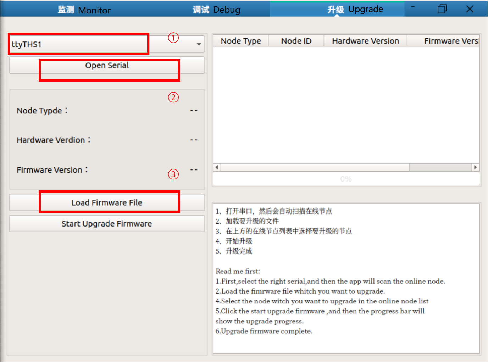


Select the firmware information in the firmware list, and then click the Start Upgrade button to start the firmware upgrade.

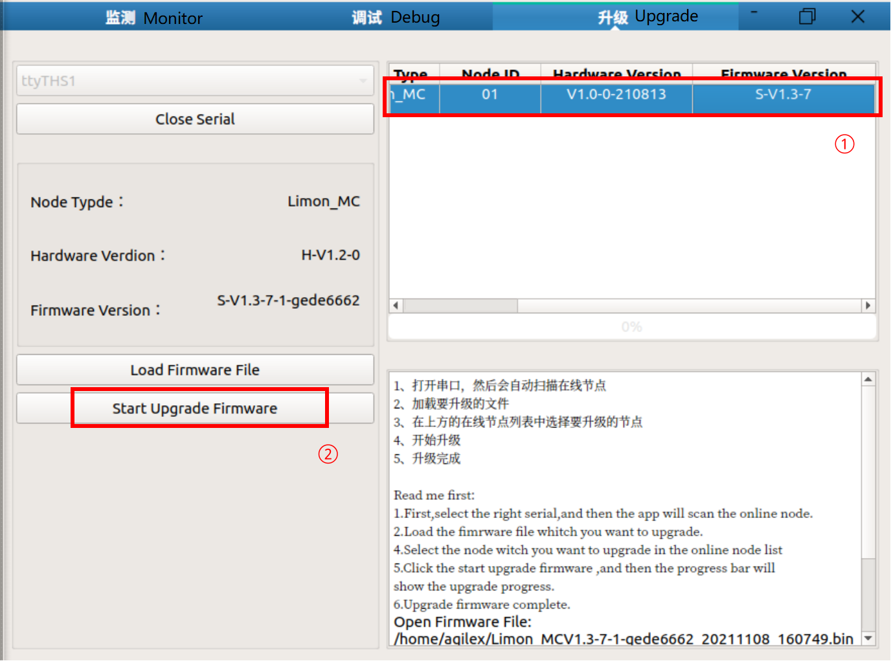

After the upgrade is successful, click the Close Serial button to close the serial port.

### Appendix 7  Parameter Configuration of Navigation Package

If you need to try to debug the parameters in the package yourself, you can refer to the following list.

#### 7.1 Configurable parameters in the gmapping package

**Note:** The parameter configuration file of the gmapping package is:~/agilex_ws/src/limo_ros/limo_bringup/launch/limo_gmapping.launch

| **Parameter**             | **Type** | **Default** | **Description**                                              |
| ------------------------- | -------- | ----------- | ------------------------------------------------------------ |
| ~throttle_scans           | int      | 1           | The scan data threshold to be processed; the default is to process 1 scan data at a time (it can be set larger to skip some scan data) |
| ~base_frame               | string   | base_link   | Robot base coordinate system                                 |
| ~map_frame                | string   | map         | Map coordinate system                                        |
| ~odom_frame               | string   | odom        | Odometer coordinate system                                   |
| ~map_update_interval      | float    | 5.0         | Map update frequency                                         |
| ~maxUrange                | float    | 80          | Detect the maximum available range, that is, the range that the beam can reach |
| ~sigma                    | float    | 0.05        | Standard deviation of endpoint matching                      |
| ~kernelSize               | int      | 1           | Used to find the corresponding kernel size                   |
| ~lstep                    | float    | 0.05        | Translation optimization step                                |
| ~astep                    | float    | 0.05        | Rotation optimization step                                   |
| ~iterations               | int      | 5           | Scan matching iterations                                     |
| ~lsigma                   | float    | 0.075       | Laser standard deviation for likelihood calculation          |
| ~ogain                    | float    | 3.0         | Used for smooth resampling effect during likelihood calculation |
| ~lskip                    | int      | 0           | The number of beams skipped in each scan.                    |
| ~minimumScore             | float    | 0.0         | The lowest value of the scan matching result                 |
| ~srr                      | float    | 0.1         | The mileage error during translation as a translation function (rho/rho) |
| ~srt                      | float    | 0.2         | The mileage error during translation as a rotation function (rho/theta) |
| ~str                      | float    | 0.1         | The mileage error during rotation as a translation function(theta/rho) |
| ~stt                      | float    | 0.2         | The mileage error during rotation as a rotation function (theta/theta) |
| ~linearUpdate             | float    | 1.0         | The robot translates a certain distance and processes the laser data once |
| ~angularUpdate            | float    | 0.5         | The robot rotates a certain distance and processes the laser data once |
| ~temporalUpdate           | float    | -1.0        | If the latest scan processing is slower than the update, one scan is processed. Turn off time-based updates when the value is negative. |
| ~resampleThreshold        | float    | 0.5         | Resampling threshold based on Neff                           |
| ~particles                | int      | 30          | Number of particles in the filter                            |
| ~xmin                     | float    | -100.0      | The initial minimum size of the map in the x direction       |
| ~ymin                     | float    | -100.0      | The initial minimum size of the map in the y direction       |
| ~xmax                     | float    | 100.0       | The initial maximum size of the map in the x direction       |
| ~ymax                     | float    | 100.0       | The initial maximum size of the map in the y direction       |
| ~delta                    | float    | 0.05        | Map resolution                                               |
| ~llsamplerange            | float    | 0.01        | The translation sampling distance of likelihood calculation  |
| ~llsamplestep             | float    | 0.01        | The translation sampling step of likelihood calculation      |
| ~lasamplerange            | float    | 0.005       | The angle sampling distance of likelihood calculation        |
| ~lasamplestep             | float    | 0.005       | The angle sampling step of likelihood calculation            |
| ~transform_publish_period | float    | 0.05        | TF transform publishing period                               |
| ~occ_thresh               | float    | 0.25        | The threshold of raster map occupancy rate                   |
| ~maxRange                 | float    | ——          | The maximum range of sensor                                  |

#### 7.2 Configurable parameters in the cartographer package

**Note:** The parameter file of the cartographer package is:

| **Parameter**                   | **Default**    | **Analysis**                                                 |
| ------------------------------- | -------------- | ------------------------------------------------------------ |
| map_frame                       | map            | The ID of the ROS coordinate system used to publish submaps, the parent coordinate system of the pose, usually "map". |
| tracking_frame                  | base_footprint | The ID of the ROS coordinate system tracked by the SLAM algorithm. If IMU is used, its coordinate system should be used, usually "imu_link". |
| published_frame                 | odom           | The ID of the ROS coordinate system used to publish the pose sub-coordinate system, like the "odom" coordinate system. If an "odom" coordinate system is provided by different parts of the system, in this case, the "odom" pose in the map_frame will be published. Otherwise, it may be appropriate to set it to "base_link". |
| odom_frame                      | odom           | It is enabled when provide_odom_frame is true. The coordinate system is used to publish local SLAM results between published_frame and map_frame, usually "odom". |
| provide_odom_frame              | true           | If enabled, local, non-closed-loop, and continuous poses will be published as odom_frame in map_frame. |
| use_odometry                    | false          | If enabled, subscribe to nav_msgs/Odometry messages on the "odom" topic. The mileage information will be provided, which is included in SLAM. |
| num_laser_scans                 | 1              | The number of laser scanning topics subscribed. Subscribe to sensor_msgs/LaserScan on the "scan" topic of one laser scanner or subscribe to the topics "scan_1", "scan_2", etc. on multiple laser scanners. |
| num_multi_echo_laser_scans      | 0              | The number of subscribed multi-echo laser scanning topics. Subscribe to sensor_msgs/MultiEchoLaserScan on the "echoes" topic of a laser scanner or subscribe to the topics "echoes_1", "echoes_2", etc. for multiple laser scanners. |
| num_subdivisions_per_laser_scan | 1              | The number of point clouds that divide each received (multi-echo) laser scan. The subdivision scan can cancel the scan acquired by the scan when the scanner is moving. There is a corresponding trajectory builder option to accumulate subdivision scans into the point cloud that will be used for scan matching. |
| num_point_clouds                | 0              | The number of point cloud topics to be subscribed to. Subscribe to sensor_msgs/PointCloud2 on the "points2" topic of a range finder or subscribe topics "points2_1", "points2_2", etc. for multiple range finders. |
| lookup_transform_timeout_sec    | 0.2            | The timeout seconds of looking up and transforming with tf2. |
| submap_publish_period_sec       | 0.3            | The period (in seconds) for publishing submaps, eg.0.3 seconds. |
| pose_publish_period_sec         | 5e-3           | The period (in seconds) for publishing poses, eg. 5e-3, with a frequency of 200 Hz. |
| trajectory_publish_period_sec   | 30e-3          | The period for publishing trajectory tag in seconds, eg. 30e-3, lasting 30 milliseconds. |

#### 7.3 Configurable parameters in the amcl package

**Note:** The parameter configuration files of the amcl package are: amcl_param_diff.yaml (the file is the amcl parameter file used in the four-wheel differential, omnidirectional wheel, and track motion modes), and amcl_param.yaml (the file is the amcl parameter file used in the Ackermann motion mode) .

| **Parameter**       | **Type** | **Default**    | **Description**                                              |
| ------------------- | -------- | -------------- | ------------------------------------------------------------ |
| min_particles       | int      | 100            | The minimum number of particles allowed.                     |
| max_particles       | int      | 5000           | The maximum number of particles allowed.                     |
| kld_err             | double   | 0.01           | The maximum error between the true distribution and the estimated distribution. |
| kld_z               | double   | 0.99           | The upper normal quantile of (1-p), where p is the probability that the error on the estimated detuning will be less than kld_err. |
| update_min_d        | double   | 0.2米          | A translation movement needs to be performed before performing the filter update. |
| update_min_a        | double   | π/ 6.0 radians | A rotation movement needs to be performed before performing the filter update. |
| resample_interval   | int      | 2              | The number of filter updates required before resampling.     |
| transform_tolerance | double   | 0              | The time at which the published transformation will be post-processed to indicate that the transformation will be effective in the future. |
| recovery_alpha_slow | double   | 0              | The exponential decay rate of the slow average weight filter is used to decide when to recover by adding random poses. A good value may be 0.001. |
| recovery_alpha_fast | double   | 0.0米          | The exponential decay rate of the fast average weight filter is used to decide when to recover by adding random poses. A good value may be 0.1. |
| initial_pose_x      | double   | 0.0米          | The initial pose average (x), used to initialize the filter with Gaussian distribution. |
| initial_pose_y      | double   | 0.0弧度        | The initial pose average (y), used to initialize the filter with Gaussian distribution. |
| initial_pose_a      | double   | 0.5 * 0.5米    | The initial pose average (yaw), used to initialize the filter with Gaussian distribution. |
| initial_cov_xx      | double   | 0.5 * 0.5米    | The initial pose covariance (x * x), used to initialize the filter with Gaussian distribution. |
| initial_cov_yy      | double   | -1.0 Hz        | The initial pose covariance (y * y), used to initialize the filter with Gaussian distribution. |
| initial_cov_aa      | double   | 0.5 Hz         | The initial pose covariance (yaw * yaw), used to initialize the filter with Gaussian distribution. |
| gui_publish_rate    | double   | FALSE          | The maximum rate (Hz) of publishing visual scans and paths. -1.0 is disabled. |
| save_pose_rate      | double   | FALSE          | Store the maximum rate (Hz) of the last estimated pose and covariance of the parameter server in the variables ~initial_pose_ and ~initial_cov_. This saved pose will be used in subsequent runs to initialize the filter. -1.0 is disabled. |
| use_map_topic       | bool     | -1             | When set to be true, AMCL will subscribe to the map topic instead of making a service call to receive its map. |
| first_map_only      | bool     | -1             | When set to be true, AMCL will only use the first mapping it subscribes to instead of updating each time a new mapping is received. |

#### 7.4 Configurable parameters in DWA

Note: The configuration parameter file of DWA is ~/agilex_ws/src/limo_ros/limo_bringup/param/diff/planner.yaml

| **Parameter**           | **Type** | **Default** | **Description**                                              |
| ----------------------- | -------- | :---------: | ------------------------------------------------------------ |
| acc_lim_x               | double   |     2.5     | Robot’s x acceleration limit (m/s2)                          |
| acc_lim_y               | double   |     2.5     | Robot’s y acceleration limit (m/s2)                          |
| acc_lim_th              | double   |     3.2     | Robot’s rotational acceleration limit (m/s2)                 |
| max_vel_trans           | double   |    0.55     | The absolute value of the maximum translational velocity of the robot (m/s). |
| min_vel_trans           | double   |     0.1     | The absolute value of the minimum translational velocity of the robot (m/s). |
| max_vel_x               | double   |    0.55     | Robot’s maximum x velocity (m/s)                             |
| min_vel_x               | double   |     0.0     | Robot’s minimum x velocity (m/s), negative when moving in reverse |
| max_vel_y               | double   |     0.1     | Robot’s maximum y velocity (m/s)                             |
| min_vel_y               | double   |    -0.1     | Robot’s minimum y velocity (m/s)                             |
| max_rot_vel             | double   |     1.0     | The absolute value of the maximum rotation velocity of the robot (rad/s) |
| min_rot_vel             | double   |     0.4     | The absolute value of the minimum rotation velocity of the robot (rad/s) |
| yaw_goal_tolerance      | double   |    0.05     | The radian tolerance of the yaw/rotation when the controller achieves its goal |
| xy_goal_tolerance       | double   |    0.10     | The tolerance of the controller in the distance between x and y when achieving the goal (m/s) |
| latch_xy_goal_tolerance | bool     |    false    | If the goal tolerance is locked, when the robot reaches the goal xy position, it will simply rotate into position, even if it eventually exceeds the goal tolerance while doing so. |
| sim_time                | double   |     1.7     | Time to simulate the trajectory forward in seconds           |
| sim_granularity         | double   |    0.025    | Step taken between points on a given trajectory (m/s)        |
| vx_samples              | int      |      3      | The number of samples used when exploring the x velocity space |
| vy_samples              | int      |     10      | The number of samples used when exploring the y velocity space |
| vth_samples             | int      |     20      | The number of samples used when exploring the theta velocity space |
| controller_frequency    | double   |    20.0     | Call the controller’s frequency. If it is not set in the controller's namespace, use searchParam to read the parameters from the parent namespace. Use together with move_base, which means you only need to set its "controller_frequency" parameter and you can safely not set this parameter. |
| path_distance_bias      | double   |    32.0     | The weight that how close the controller should be to the given path |
| goal_distance_bias      | double   |    24.0     | The weight that the controller should try to reach its local goal and it should also control the velocity |
| occdist_scale           | double   |    0.01     | The weight that the controller should try to avoid obstacles |
| forward_point_distance  | double   |    0.325    | The distance from the center of the robot to the additional scoring point, in meters |
| stop_time_buffer        | double   |     0.2     | The amount of time the robot must stop before colliding for the trajectory to be valid, in seconds |
| scaling_speed           | double   |    0.25     | The absolute value of the speed at which the robot's footprint is scaled (m/s) |
| max_scaling_factor      | double   |     0.2     | The biggest factor in scaling a robot's footprint            |
| publish_cost_grid       | bool     |    false    | Whether the cost grid that the planner will use when planning will be published? When it’s true, sensor_msgs/PointCloud2 will be available on the ~/cost_cloud topic. Each point cloud represents a cost grid and has a field for each individual scoring function component and the total cost of each cell, taking the scoring parameters into account. |
| oscillation_reset_dist  | double   |    0.05     | How far the robot must move in meters before resetting the oscillation tag |
| prune_plan              | bool     |    true     | Define whether the robot will eat the plan when moving along the path. If it’s set to be true, the points will fall from the end of the plan as soon as the robots move more than 1 meter. |

#### 7.5 Configurable parameters in TEB

**Note:** The parameter configuration file of TEB is:

~/agilex_ws/src/limo_ros/limo_bringup/param/carlike2/teb_local_planner_params.yaml

| **Parameter**                               | **Type** | **Default**      | **Description**                                              |
| ------------------------------------------- | -------- | ---------------- | ------------------------------------------------------------ |
| acc_lim_x                                   | double   | 0.5              | Robot’s maximum translational acceleration (m/s ^2)          |
| acc_lim_theta                               | double   | 0.5              | Robot’s maximum angular acceleration (radian/s ^2)           |
| max_vel_x                                   | double   | 0.4              | Robot’s maximum translational velocity (m/s)                 |
| max_vel_x_backwards                         | double   | 0.2              | The maximum absolute translational velocity (in m/s) when the robot is traveling backwards. |
| max_vel_theta                               | double   | 0.3              | Robot’s maximum angular velocity (radian/s)                  |
| min_turning_radius                          | double   | 0.0              | Automotive robot’s minimum turning radius (set to be zero for differential drive robots). |
| wheelbase                                   | double   | 1.0              | The distance between the rear axle and the front axle. For rear-wheel robots, this value may be negative (only required when cmd_angle_instead_rotvel is set to be true). |
| cmd_angle_instead_rotvel                    | bool     | false            | Replace the rotation velocity in the command velocity message with the corresponding steering angle [-pi/2, pi/2]. Note that it is not advisable to change the semantics of the yaw rate according to the application. Here, it is only the input required by the stage simulator.The data type in ackermann_msgs is more appropriate, but move_base does not support it. The local planner itself does not intend to send commands. |
| max_vel_y                                   | double   | 0.0              | Robot’s maximum sweep velocity (it should be zero for incomplete robots!) |
| acc_lim_y                                   | double   | 0.5              | Robot’s maximum sweep acceleration                           |
| footprint_model/type                        | double   | point            | Specify the type of robot footprint model used for optimization. The different types are "point", "circle", "line", "two_circles" and "polygon". The type of model can significantly affect the required calculation time. |
| footprint_model/radius                      | double   | 0.2              | This parameter is only related to the "circle" type. It contains the radius of the circle. The center of the circle is on the rotation axis of the robot. |
| footprint_model/line_start                  | double   | [-0.3, 0.0]      | This parameter is only related to the "line" type. It contains the starting coordinates of the line segment. |
| footprint_model/line_end                    | double   | [0.3, 0.0]       | This parameter is only related to the "line" type. It contains the ending coordinates of the line segment. |
| footprint_model/front_offset                | double   | 0.2              | This parameter is only related to the "two_circles" type. It describes how much the center of the front circle has moved along the x-axis of the robot. Assume that the rotation axis of the robot is located at [0,0]. |
| footprint_model/front_radius                | double   | 0.2              | This parameter is only related to the "two_circles" type. It contains the radius of the front circle. |
| footprint_model/rear_offset                 | double   | 0.2              | This parameter is only related to the "two_circles" type. It describes how much the center of the back circle has moved along the negative x-axis of the robot. Assume that the rotation axis of the robot is located at [0,0]. |
| footprint_model/rear_radius                 | double   | 0.2              | This parameter is only related to the "two_circles" type. It contains the radius of the back circle. |
| footprint_model/vertices                    | double   | [0.25,-0.05]     | This parameter is only related to the "polygon" type. It contains a list of polygon vertices (each is a two-dimensional coordinate). Polygons are always closed: do not repeat the first vertex at the end. |
| is_footprint_dynamic                        | bool     | false            | If it’s true, the footprint is updated before checking the trajectory's feasibility. |
| xy_goal_tolerance                           | double   | 0.2              | Allowable final Euclidean distance to the goal position (in meters). |
| yaw_goal_tolerance                          | double   | 0.2              | Allowable final direction error (in radians).                |
| free_goal_vel                               | bool     | false            | Remove the goal velocity constraint, so that the robot can reach the goal at the maximum velocity. |
| dt_ref                                      | double   | 0.3              | The required time resolution of the trajectory (the trajectory is not fixed to dt_ref, because the time resolution is part of the optimization, but if dt_ref +-dt_hysteresis is violated, the trajectory size will be adjusted between iterations. |
| dt_hysteresis                               | double   | 0.1              | The lag that is automatically resized according to the current time resolution, usually about 10% of the recommended dt_ref. |
| min_samples                                 | int      | 3                | Minimum number of samples (should always be greater than 2). |
| global_plan_overwrite_orientation           | bool     | true             | Override the direction of the local sub-goals provided by the global planner (because they usually only provide a two-dimensional path). |
| global_plan_viapoint_sep                    | double   | -0.1 (disabled)) | If it is positive, the via points are extracted from the global plan (path following mode). This value determines the resolution of the reference path (the minimum period between every two consecutive via points along the global plane, if it is negative. |
| max_global_plan_lookahead_dist              | double   | 3.0              | Specify the maximum length (cumulative Euclidean distance) of the subset of the global plan considered for optimization. The actual length is determined by the logical combination of the size of the local cost map and this maximum limit. Set to be zero or a negative number to deactivate this limit. |
| force_reinit_new_goal_dist                  | double   | 1.0              | If the previous goal update period is greater than the specified value (in meters), re-initialize the trajectory (skip hot start). |
| feasibility_check_no_poses                  | bool     | 4                | Specify that the feasibility of the pose on the prediction plan should be checked during each sampling period. |
| publish_feedback                            | bool     | false            | Publish planner feedback with complete trajectory and active obstacle list (it should only be enabled for evaluation or debugging). See the publisher list above. |
| shrink_horizon_backup                       | bool     | true             | Allow the planner to temporarily shrink the scope (50%) in the event that a problem (such as infeasibility) is automatically detected. See also parameter shrink_horizon_min_duration. |
| allow_init_with_backwards_motion            | bool     | false            | If it’s true, the base trajectory may be initialized with backward motion in case the goal is behind the starting point in the local cost map (this is only recommended if the robot is equipped with a rear sensor). |
| exact_arc_length                            | double   | false            | If it’s true, the planner uses the precise arc length (-> increased CPU time) in the calculation of velocity, acceleration and turn rate, otherwise it uses the Euclidean approximation. |
| shrink_horizon_min_duration                 | double   | 10.0             | If an infeasible trajectory is detected, please specify the shortest duration for shrinking the horizon (see the parameter shrink_horizon_backup to activate the shrink horizon mode). |
| min_obstacle_dist                           | double   | 0.5              | The minimum expected distance to the obstacle (in meters).   |
| include_costmap_obstacles                   | double   | true             | Specify whether or not the obstacles of the local cost map should be considered. Each cell marked as an obstacle is treated as a point obstacle. Therefore, do not choose a very small cost map resolution, because it will increase the calculation time. In future versions, this situation will be resolved and additional api will be provided for dynamic obstacles. |
| costmap_obstacles_behind_robot_dist         | bool     | 1.0              | Limit the occupied local cost map obstacles that are taken into account when planning behind the robot (specify the distance in meters) . |
| obstacle_poses_affected                     | double   | 30               | Each obstacle position is attached to the nearest pose on the trajectory to maintain the distance. You can also consider additional neighbors. Please note that this parameter may be removed in a future version because the obstacle association strategy has been modified in kinetic+. Refer to the parameter description of legacy_obstacle_association. |
| inflation_dist                              | double   | pre kinetic      | Buffer around obstacles with non-zero penalty cost (should be greater than min_obstacle_dist to take effect). Refer weight_inflation. |
| include_dynamic_obstacles                   | string   | false            | If this parameter is set to be true, the motion of obstacles with non-zero velocity will be predicted and considered through the constant velocity model during the optimization process (provided through user-provided obstacles or obtained from the costmap_converter).  New |
| legacy_obstacle_association                 | bool     | false            | The strategy for connecting trajectory poses and optimizing obstacles has been revised (see change log). You can switch to the old/previous strategy by setting this parameter to be true. Old strategy. |
| obstacle_association_force_inclusion_factor | double   | 1.5              | The non-legacy obstacle association strategy tries to connect only the relevant obstacles with the discretized trajectory in the optimization process. But all obstacles within the specified distance are forcibly included (as a multiple of min_obstacle_dist). For example, choose 2.0 to force the consideration of obstacles within a radius of 2.0*min_obstacle_dist. [This parameter is used only when the parameter legacy_obstacle_association is false] |
| obstacle_association_cutoff_factor          | int      | 5                | See obstacle_association_force_inclusion_factor, but all obstacles that exceed the multiple of [value] * min_obstacle_dist are ignored in the optimization process. The parameter obstacle _association_force_inclusion_factor is processed first. [This parameter is used only when the parameter legacy_obstacle_association is false] |
| costmap_converter_plugin                    | int      | ""               | Define the plug-in name to convert cost map cells to points/lines/polygons. Set an empty string to disable conversion so that all cells are treated as point obstacles. |
| costmap_converter_spin_thread               | double   | true             | If set to be true, the cost map converter calls its callback queue in a different thread. |
| costmap_converter_rate                      | double   | 5.0              | Rate defines the frequency that the costmap_converter plugin processes the current cost map(This value should not be higher than the cost map update rate) [in Hertz]. |
| no_inner_iterations                         | double   | 5                | The actual number of solver iterations called in each outer loop iteration. See parameter no_outer_iterations. |
| no_outer_iterations                         | double   | 4                | Each outer loop iteration will automatically adjust the trajectory size and call the internal optimizer (execute no_inner_iterations) according to the required time resolution dt_ref. Therefore, the total number of solver iterations in each planning cycle is the product of the two values. |
| penalty_epsilon                             | double   | 0.1              | Add a small safety margin to the penalty function of the hard constraint approximation. |
| weight_max_vel_x                            | double   | 2.0              | Optimized weight to meet the maximum allowable translational velocity. |
| weight_max_vel_theta                        | double   | 1.0              | Optimized weight to meet the maximum allowable angular velocity. |
| weight_acc_lim_x                            | double   | 1.0              | Optimized weight to meet the maximum allowable translational acceleration. |
| weight_acc_lim_theta                        | double   | 1.0              | Optimized weight to meet the maximum allowable angular acceleration. |
| weight_kinematics_nh                        | double   | 1000.0           | The optimized weight used to meet non-holonomic kinematics (this parameter must be very high, because the kinematics equation constitutes an equality constraint, and the "original" cost value is small compared with other costs, so even a value of 1000 does not mean the matrix condition is not good). |
| weight_kinematics_forward_drive             | double   | 1.0              | The optimized weight to force the robot to select only the forward direction (positive translational velocity). The small weight (eg. 1.0) still allows driving backwards. A value around 1000 can almost prevent backward driving (but it cannot be guaranteed). |
| weight_kinematics_turning_radius            | double   | 1.0              | The optimized weight to force the minimum turning radius (only for automobile  robots). |
| weight_optimaltime                          | double   | 1.0              | Optimized weight to shorten trajectory wrt conversion/execution time. |
| weight_obstacle                             | bool     | 50.0             | Optimized weight to keep the minimum distance from the obstacle. |
| weight_viapoint                             | bool     | 1.0              | The optimized weight (corresponding reference path) used to minimize the distance to the passing point. 0.4 new version. |
| weight_inflation                            | int      | 0.1              | The optimized weight of the inflation penalty (should be small). |
| weight_adapt_factor                         | double   | 2.0              | In each outer TEB iteration (weight_new = weight_old*factor), some special weights (currently weight_obstacle) are repeatedly scaled by this factor. Iteratively increasing the weights instead of setting a huge prior value will lead to better numerical conditions for the basic optimization problem. |
| enable_homotopy_class_planning              | double   | true             | Activate parallel planning in different topologies (requires more CPU resources because multiple trajectories are optimized at once). |
| enable_multithreading                       | double   | true             | Activate multiple threads to plan each trajectory in different threads. |
| max_number_classes                          | bool     | 4                | Specify the maximum number of different trajectories to be considered (limits the computational effort). |
| selection_cost_hysteresis                   | int      | 1.0              | Specify how much trajectory cost the new candidate must have compared to the previously selected trajectory to be selected (select if new_cost <old_cost*factor). |
| selection_obst_cost_scale                   | double   | 100.0            | Additional scaling of the obstacle cost term used only to select the "best" candidate. |
| selection_viapoint_cost_scale               | double   | 1.0              | The additional scaling used only to select the "best" candidate through the point cost clause. 0.4 new version. |
| selection_alternative_time_cost             | double   | false            | If it's true, the time cost (sum of squares of the time difference) will be replaced with the total conversion time (sum of the time difference). |
| roadmap_graph_no_samples                    | double   | 15               | Specify the number of samples generated to create the roadmap. |
| roadmap_graph_area_width                    | bool     | 6                | Sample the random keypoints/waypoints in the rectangular area between the starting point and the goal. Specify the width of the area in meters. |
| h_signature_prescaler                       | bool     | 1.0              | The internal parameter (H-signature) of the ratio used to distinguish homotopy classes. Warn |
| h_signature_threshold                       | double   | 0.1              | If the differences between the real part and the complex part are lower than the specified threshold, it is assumed that the two H signatures are equal. |
| obstacle_heading_threshold                  | string   | 1.0              | Specify the value of the scalar product between the obstacle course and the goal course so that they (obstacles) are taken into account when exploring. |
| visualize_hc_graph                          | string   | false            | Visualize the graph created to explore the unique trajectory (check the tag message in rviz). |
| viapoints_all_candidates                    | bool     | true             | If it’s true, all trajectories of different topologies are attached to a set of via points, otherwise only trajectories that share the same topology with the initial/global plan are connected to them (no effect on test_optim_node).  0.4 new version |
| switching_blocking_period                   | double   | 0.0              | Specify the duration (in seconds) that needs to expire before being allowed to switch to the new equivalence class. |
| odom_topic                                  | double   | odom             | The subject name of the odometer message, provided by the robot driver or simulator. |
| map_frame                                   | bool     | odom             | Global planning framework (if it is a static map, this parameter usually must be changed to "/map". |

 

 

 

 

 

 

 

 

 

 